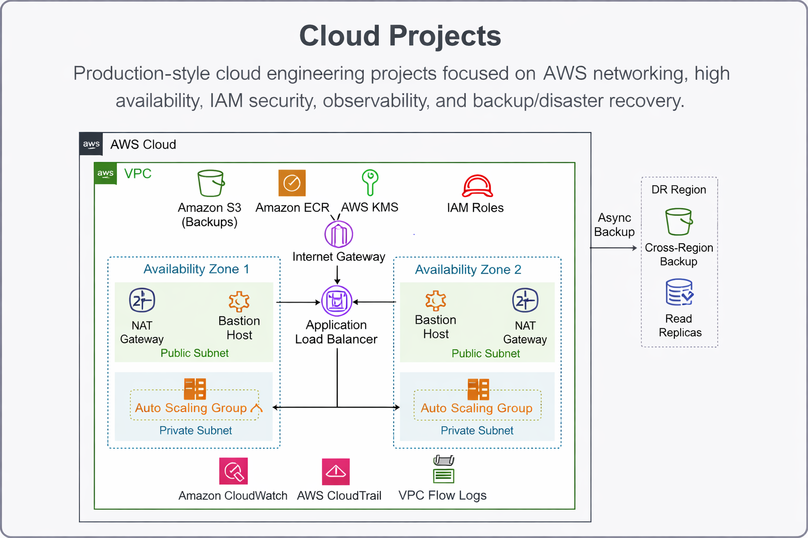

# ☁️ Cloud Engineering Projects — Production Portfolio

## 👩🏽‍💻 Liliane Konissi

**Linux Administrator | DevOps & Cloud Engineer**

🚀 Hands-on AWS cloud projects demonstrating **production infrastructure design, security, monitoring, and disaster recovery** built entirely from scratch using CLI workflows.

---

## 🧭 Operational Documentation

- Platform Architecture → docs/architecture.md
- Operations Runbooks → docs/runbooks.md
- Incident Response Guide → docs/incident-response.md

---

## ⚡ What I Can Do 

✅ Design secure **production VPC architectures**
✅ Build **high-availability systems** with Load Balancing & Auto Scaling
✅ Implement **least-privilege IAM & encrypted secrets**
✅ Monitor infrastructure using CloudWatch & Flow Logs
✅ Investigate incidents using real log analysis
✅ Implement **backup, restore, and disaster recovery** strategies

---

## 🧱 Core Skills Demonstrated

| Category    | Technologies                         |
| ----------- | ------------------------------------ |
| Cloud       | AWS (EC2, VPC, ALB, ASG, S3, EBS)    |
| Networking  | Public/Private Subnets, NAT, Routing |
| Security    | IAM, KMS, Secrets Manager            |
| Reliability | Snapshots, Versioning, DR Recovery   |
| Monitoring  | CloudWatch, SNS, Flow Logs           |
| OS          | Linux Administration                 |
| Automation  | AWS CLI, Bash                        |

---

## 📂 Projects Included

| Project           | Focus         | Real Scenario                    |
| ----------------- | ------------- | -------------------------------- |
| Production VPC    | Networking    | Secure infrastructure foundation |
| HA Web App        | Availability  | Zero downtime during failure     |
| IAM + Secrets     | Security      | Protect application credentials  |
| Monitoring & Logs | Observability | Investigate suspicious traffic   |
| Backup & DR       | Reliability   | Recover after system failure     |

---

## 🏗️ Production Architecture Mindset

---

## 🧪 Proof of Real Operations Work

Each project includes:

* Step-by-step CLI deployment
* Failure simulations
* Recovery validation
* Troubleshooting scenarios
* Screenshot evidence

---

## 🎯 Why This Portfolio Exists

I built these projects to demonstrate how real DevOps engineers:

* Prevent outages
* Detect incidents early
* Secure infrastructure
* Recover systems quickly

---

## 📬 Contact

🌐 Portfolio: [https://lilianek.site](https://lilianek.site)
💻 GitHub: [https://github.com/lily4499](https://github.com/lily4499)

---

