# Backup/Restore + DR Mini Project (AWS)

## Context

In this mini project, I show how I protect application data from loss and how I recover quickly when something goes wrong.

I built a simple **backup / restore + disaster recovery (DR)** workflow on AWS using:

* **EC2** for the application server
* **EBS snapshots** for disk backup
* **S3 with versioning** for backup files and rollback protection
* **Cross-region copy** for a basic DR approach
* **CloudWatch + AWS CLI** for validation and verification

This is a small project, but it shows a real operations mindset:

* create backups
* keep backup copies in another region
* test restore, not just backup creation
* verify that recovery really works
* document a repeatable recovery process

---

## Problem

In many environments, backups are enabled, but restore is never tested.

That is a real risk.

### Real Ops Scenario

I have a small application running on EC2. One day, one of these problems happens:

* important files are deleted by mistake
* the EC2 instance becomes corrupted
* the attached disk has issues
* I lose access to the primary region during an incident

If I only say “backup is enabled” but I cannot restore fast, the business still loses time, data, and service availability.

---

## Solution

I created a mini backup and DR workflow with these protections:

1. **EBS snapshot backup** of the EC2 data volume
2. **S3 versioning** to protect backup files from overwrite or deletion
3. **Cross-region snapshot copy** for disaster recovery
4. **Cross-region S3 copy** for backup file redundancy
5. **Restore testing** by creating a new volume from snapshot and attaching it to a recovery EC2
6. **Rollback testing** using S3 object version history

This project proves that I do not only create backups — I also verify that recovery works.

---

## Architecture

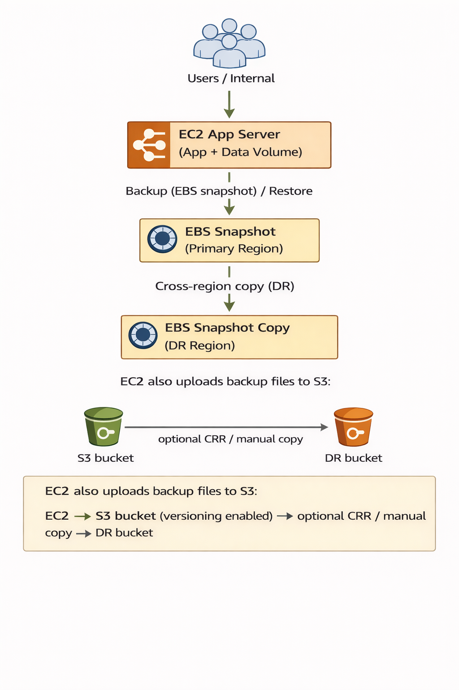

---

## Workflow

### 1. Verify AWS identity and project access

**Goal:** Confirm I am connected to the correct AWS account before creating backup resources.

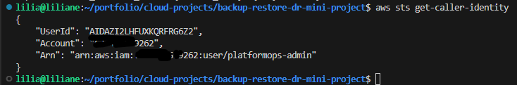

*Should show: successful AWS identity output with account ID and IAM identity.*

---

### 2. Create and protect the S3 backup locations

**Goal:** Prepare a primary backup bucket and a DR bucket with versioning enabled so backup files are protected and recoverable.

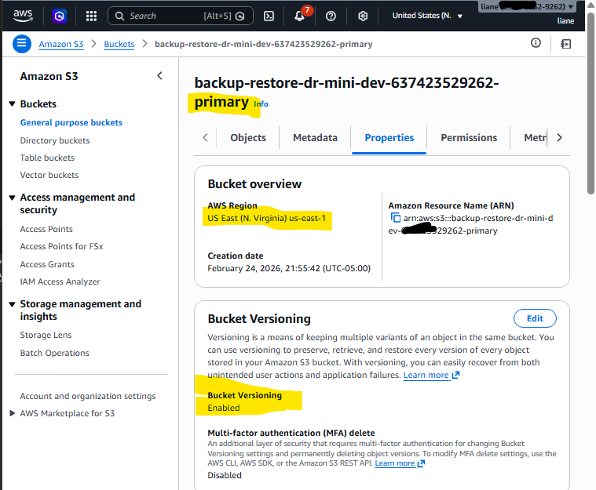

*Should show: primary S3 bucket exists and versioning is enabled.*

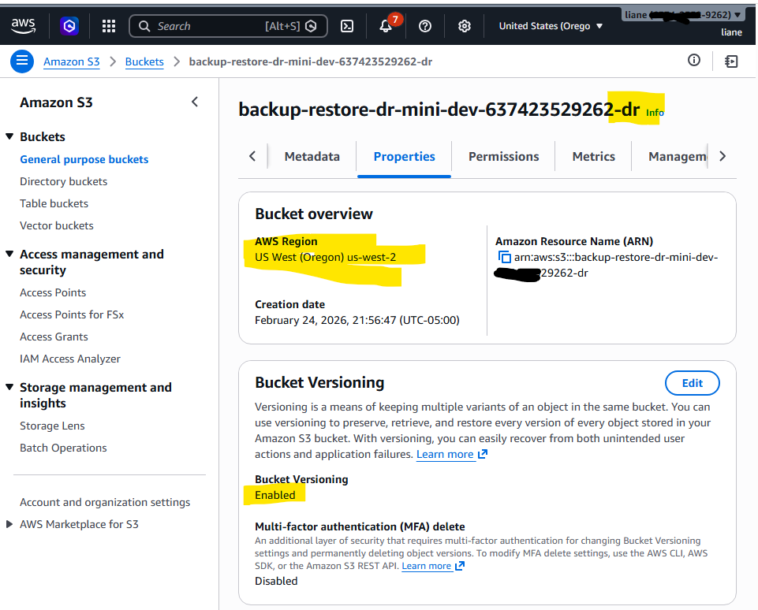

*Should show: DR S3 bucket exists in the DR region and versioning is enabled.*

---

### 3. Upload a sample backup file

**Goal:** Simulate a real application backup file and store it in S3 so I can test recovery later.

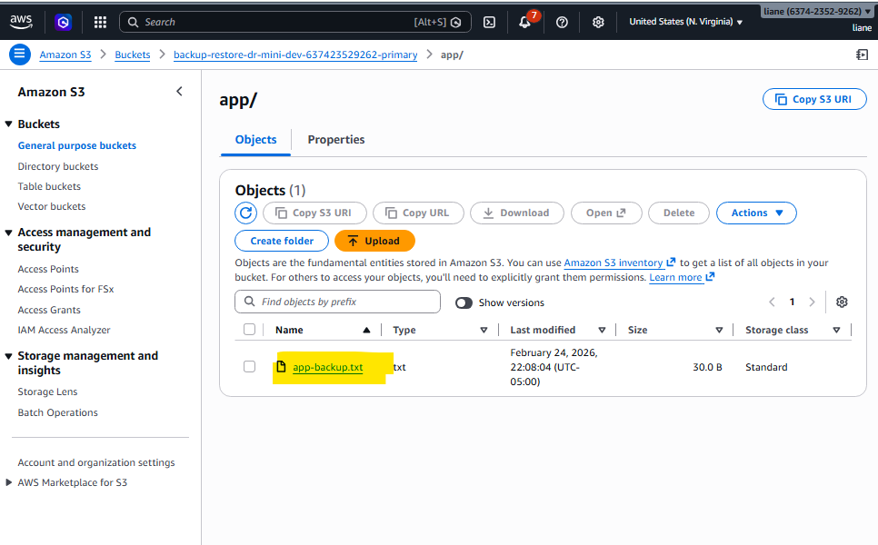

*Should show: backup file exists in the primary S3 bucket.*

---

### 4. Identify the EC2 data volume

**Goal:** Find the correct EBS volume attached to the application server so I can back up the right disk.

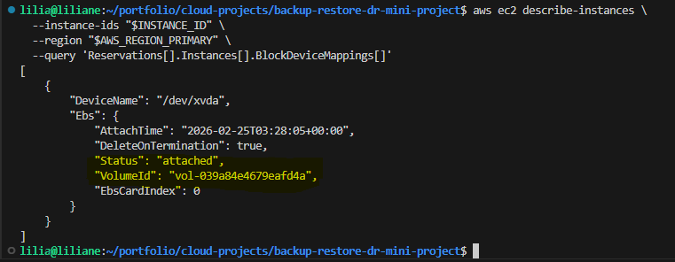

*Should show: EC2 block device mappings and the selected EBS volume ID.*

---

### 5. Create an EBS snapshot backup

**Goal:** Create a point-in-time backup of the application data volume.

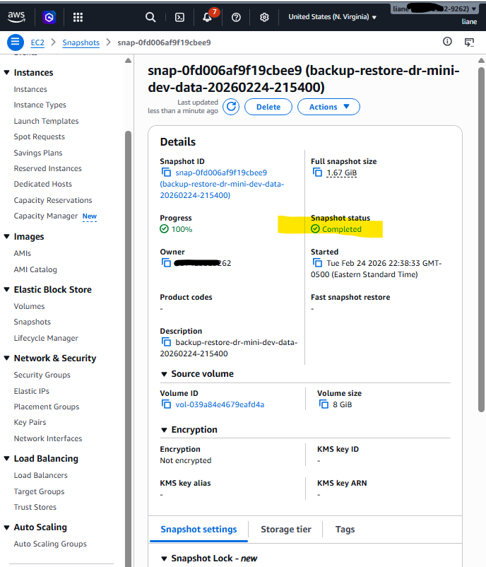

*Should show: EBS snapshot exists in the primary region with state = completed.*

---

### 6. Copy the snapshot to the DR region

**Goal:** Keep a copy of the disk backup in another AWS region in case the primary region has a major issue.


*Should show: copied snapshot exists in the DR region with state = completed.*

---

### 7. Copy the backup file to the DR S3 bucket

**Goal:** Keep application backup files available in another region for basic disaster recovery.

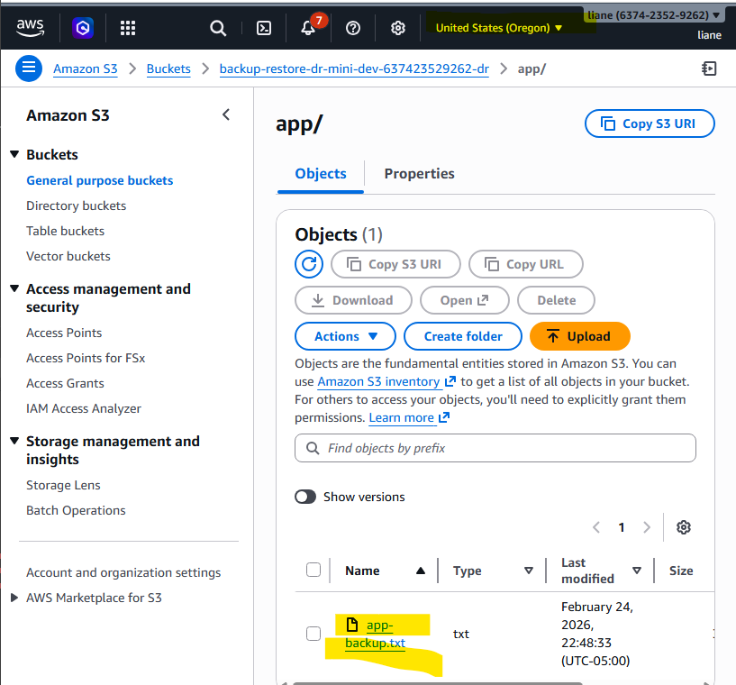

*Should show: backup file exists in the DR S3 bucket.*

---

### 8. Restore a new EBS volume from snapshot

**Goal:** Prove the backup is usable by creating a new EBS volume from the snapshot.

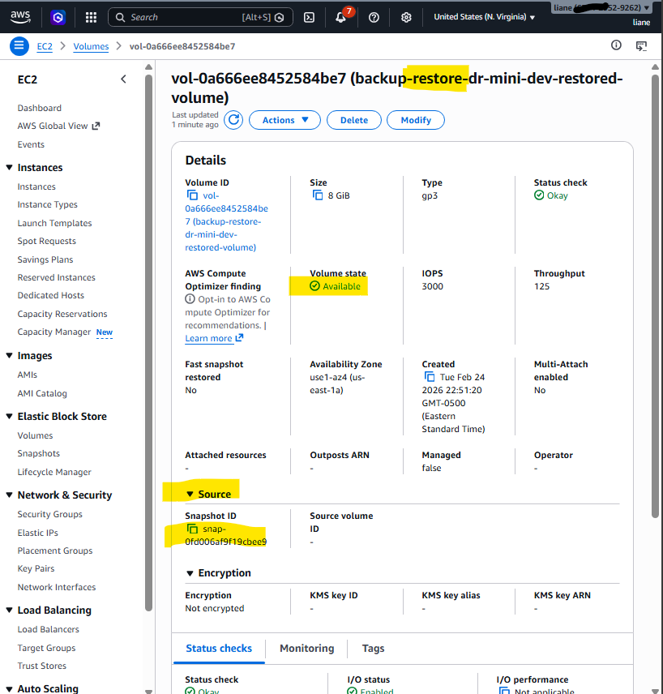

*Should show: a new EBS volume created from snapshot with state = available.*

---

### 9. Attach the restored volume to a recovery EC2 and verify data

**Goal:** Confirm that the restored disk can be attached and that the expected files are still present.

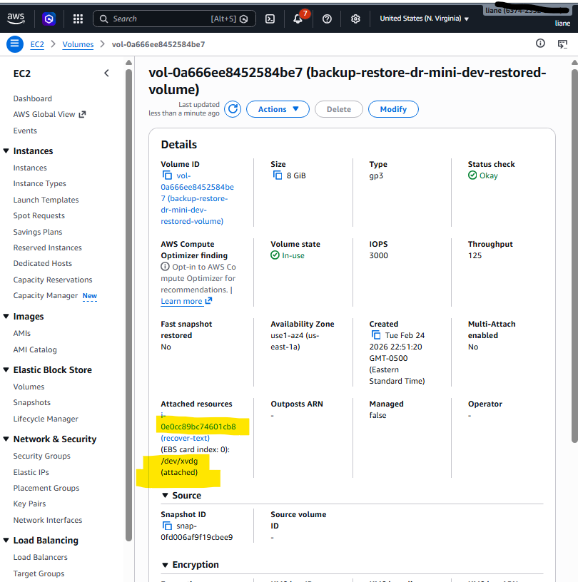

*Should show: restored volume attached to the recovery/test EC2 instance.*

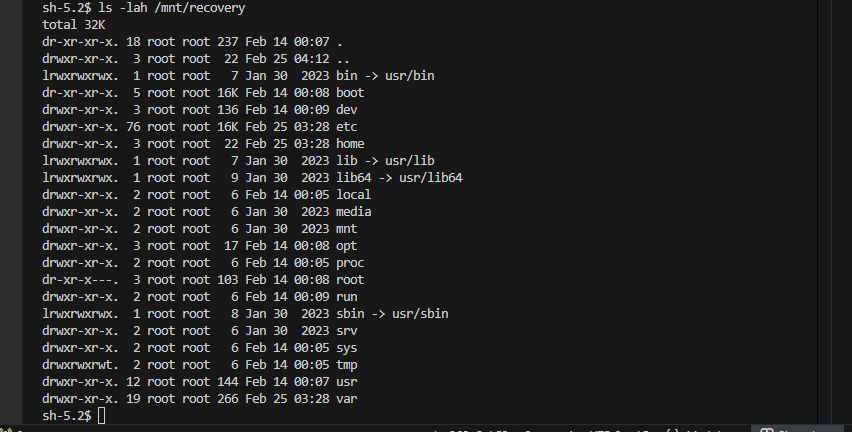

*Should show: mounted recovery volume and visible files/data.*

---

### 10. Test S3 version rollback

**Goal:** Recover a good version of a file after an accidental overwrite.

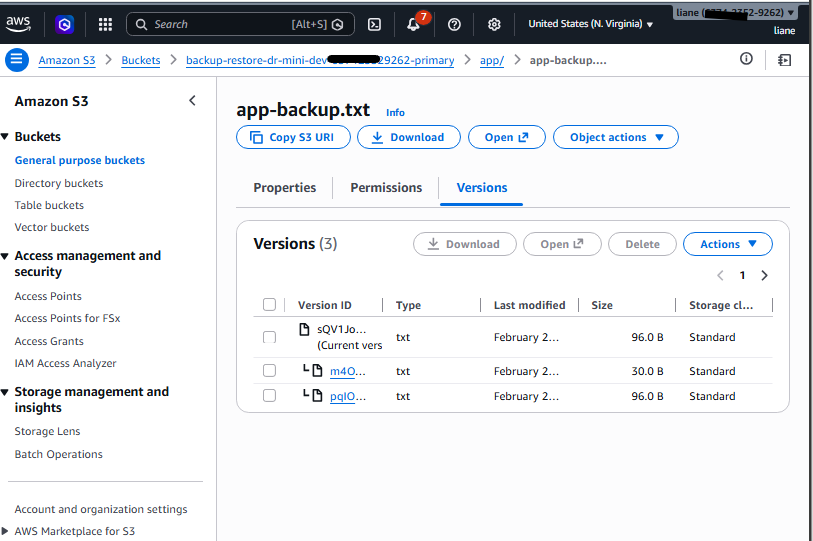

*Should show: multiple object versions for the same backup file.*

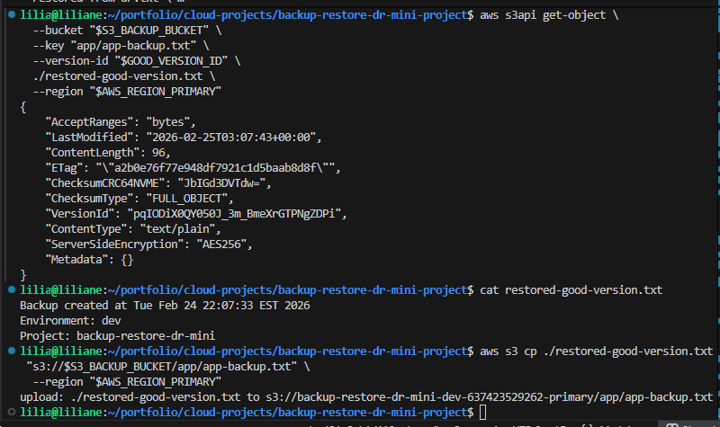

*Should show: restored file content from the original good version.*

---

## Business Impact

This project shows that I understand more than deployment. I also think about **data protection, recovery, and service resilience**.

From a business point of view, this helps with:

* **faster recovery time** when files or disks are damaged
* **reduced risk of permanent data loss**
* **better operational readiness** during incidents
* **basic disaster recovery preparation** with another AWS region
* **stronger confidence in backups** because restore is tested, not assumed

This is important because backup without restore testing is not enough in real operations.

---

## Troubleshooting

### 1. S3 bucket creation fails outside `us-east-1`

**Cause:** Missing location constraint.

**Fix:** Create the bucket with the correct region configuration.

---

### 2. Snapshot is created but restored volume cannot be attached

**Cause:** The restored EBS volume and EC2 instance are not in the same Availability Zone.

**Fix:** Make sure the restored volume is created in the same AZ as the recovery EC2.

---

### 3. Volume attachment fails

**Cause:** Wrong instance ID, wrong device name, or AZ mismatch.

**Fix:** Check:

* recovery EC2 instance ID
* volume ID
* device name
* EC2 AZ and EBS volume AZ

---

### 4. Volume attaches but mount fails

**Cause:** Wrong device path, wrong partition, or filesystem issue.

**Fix:** Check the attached disk name and identify the correct partition before mounting.

---

### 5. Previous S3 file version cannot be restored

**Cause:** Wrong version ID was selected, or versioning was not enabled before overwrite.

**Fix:** List object versions and use the correct older version ID.

---

### 6. Cross-region snapshot copy fails for encrypted snapshots

**Cause:** KMS permissions are not configured correctly for cross-region copy.

**Fix:** For a lab demo, use a simpler snapshot setup first. For production, configure the required KMS key policy and permissions.

---

## Useful CLI

### General verification

```bash
aws sts get-caller-identity
aws ec2 describe-instances --instance-ids <instance-id> --region <region>
aws ec2 describe-volumes --region <region>
aws ec2 describe-snapshots --owner-ids self --region <region>
aws s3 ls
aws s3 ls s3://<bucket-name> --recursive
```

### Backup validation

```bash
aws ec2 describe-snapshots --snapshot-ids <snapshot-id> --region <region>
aws ec2 describe-volumes --volume-ids <volume-id> --region <region>
aws s3api list-object-versions --bucket <bucket-name> --prefix <key> --region <region>
```

### Restore validation

```bash
aws ec2 describe-volumes --volume-ids <restored-volume-id> --region <region>
aws ec2 describe-volumes-modifications --volume-ids <volume-id> --region <region>
aws ec2 describe-instances --instance-ids <recovery-instance-id> --region <region>
```

### Useful troubleshoot CLI

```bash
aws ec2 describe-instances \
  --instance-ids <instance-id> \
  --region <region> \
  --query 'Reservations[].Instances[].Placement.AvailabilityZone'

aws ec2 describe-volumes \
  --volume-ids <volume-id> \
  --region <region> \
  --query 'Volumes[].AvailabilityZone'

aws ec2 describe-volumes \
  --filters Name=attachment.instance-id,Values=<instance-id> \
  --region <region>

aws s3api get-bucket-versioning --bucket <bucket-name> --region <region>

aws s3api list-object-versions \
  --bucket <bucket-name> \
  --prefix <key> \
  --region <region>
```

### On the recovery EC2

```bash
lsblk
sudo file -s /dev/xvdg
sudo blkid
sudo mkdir -p /mnt/recovery
sudo mount /dev/xvdg1 /mnt/recovery
ls -lah /mnt/recovery
```

---

## Cleanup

After testing, remove the recovery resources to avoid extra cost.

### Remove restored test volume

```bash
aws ec2 detach-volume --volume-id <restored-volume-id> --region <primary-region>
aws ec2 wait volume-available --volume-ids <restored-volume-id> --region <primary-region>
aws ec2 delete-volume --volume-id <restored-volume-id> --region <primary-region>
```

### Delete snapshots

```bash
aws ec2 delete-snapshot --snapshot-id <primary-snapshot-id> --region <primary-region>
aws ec2 delete-snapshot --snapshot-id <dr-snapshot-id> --region <dr-region>
```

### Remove S3 objects and buckets

```bash
aws s3 rm s3://<primary-backup-bucket> --recursive --region <primary-region>
aws s3 rm s3://<dr-backup-bucket> --recursive --region <dr-region>

aws s3api delete-bucket --bucket <primary-backup-bucket> --region <primary-region>
aws s3api delete-bucket --bucket <dr-backup-bucket> --region <dr-region>
```

---

