# Cloud Monitoring + Flow Logs Investigation (CloudWatch + Logs + VPC Flow Logs)

## Context

I built this project to show that I can monitor AWS infrastructure, detect network issues, and investigate traffic problems using AWS native tools.

This project demonstrates how I use:

* **Amazon CloudWatch** for metrics, dashboards, and alarms
* **Amazon SNS** for alert notifications
* **VPC Flow Logs** for network traffic visibility
* **CloudWatch Logs + Logs Insights** for investigation
* **EC2 + Security Groups** as a real test target

This is the kind of setup I would use in a real Ops/DevOps environment when users report that an application is slow, unreachable, or timing out.

---

## Problem

In production, an application can stop working even when the EC2 instance itself is still running.

### Real Ops Scenario

I deployed a web app on an EC2 instance. Then users started saying:

* “The app is not loading”
* “The server is up, but the site times out”

At first look:

* the EC2 instance is still **running**
* CPU looks **normal**
* there is no obvious system crash

So the issue may actually be caused by:

* a wrong **security group rule**
* a wrong **port**
* blocked **network traffic**
* the app listening on the wrong interface or port

Without monitoring and traffic visibility, troubleshooting becomes slow and guess-based.

---

## Solution

I built a monitoring and investigation setup that gives me fast visibility into both infrastructure health and network behavior.

The solution includes:

1. a **CloudWatch dashboard** for quick visibility into CPU, status checks, and traffic
2. **CloudWatch alarms** to detect problems early
3. **SNS notifications** to alert me when something goes wrong
4. **VPC Flow Logs** to capture ACCEPT and REJECT traffic
5. **CloudWatch Logs Insights** queries to investigate traffic behavior
6. **failure simulation** to prove the setup works in a realistic troubleshooting case

This helps me move from:

* “Users say the app is down”

to:

* “I can confirm the symptom, check monitoring, inspect traffic, identify the blocked flow, fix the rule, and verify recovery.”

---

## Architecture

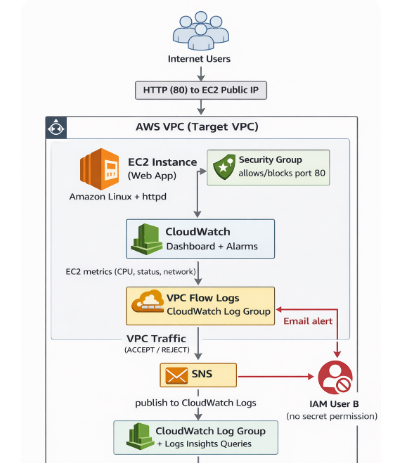

---

## Workflow with Goals + Screenshots

### 1) Build a small EC2 web server target

**Goal:** create a simple web server that I can monitor and investigate through the rest of the project.

I started with a small EC2 instance running a basic web page so I had a real endpoint to test. This gave me a working application target for monitoring, alerting, and network investigation.

**Screenshots used in the project**

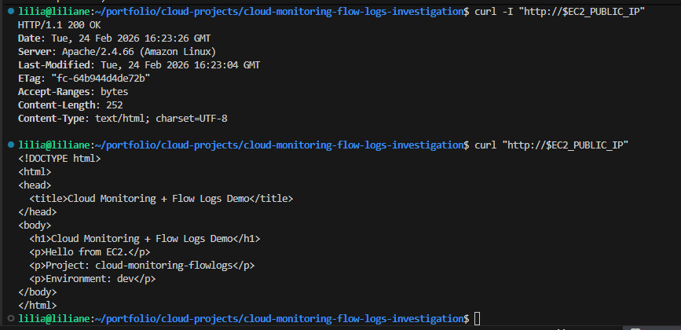

*Should show:* successful curl output proving the app is reachable.


*Should show:* the sample page loading successfully in the browser.

---

### 2) Verify AWS identity and target instance

**Goal:** confirm I am working in the correct AWS account, region, and on the correct EC2 target before building monitoring resources.

Before adding alarms and logs, I verified the AWS identity and checked the EC2 instance details to make sure the environment was correct.

**Screenshot used in the project**

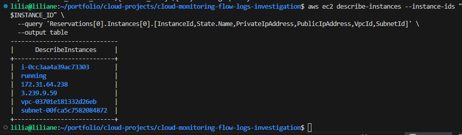

*Should show:* AWS identity plus EC2 details with the instance in running state.

---

### 3) Set up SNS email alerting

**Goal:** make sure CloudWatch alarms can notify me when an issue happens.

I created an SNS topic and email subscription so monitoring events would not stay hidden inside AWS. This makes the setup closer to real operations, where alerts must reach a person or team.

**Screenshot used in the project**

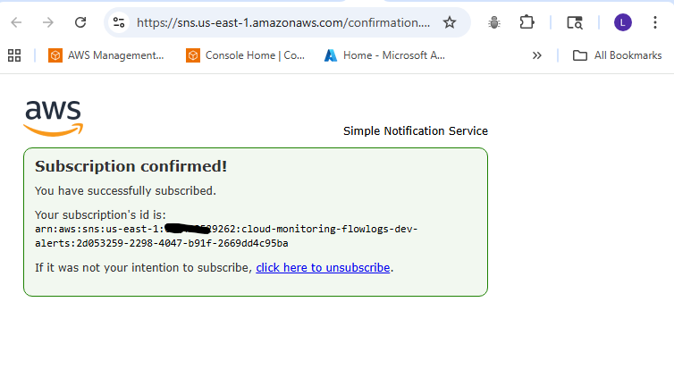

*Should show:* the SNS email subscription status as pending or confirmed.

---

### 4) Create a CloudWatch dashboard

**Goal:** get one place to quickly view infrastructure health and traffic patterns.

I built a dashboard to watch the most useful EC2 signals in one view:

* CPU utilization
* status checks
* network in/out

This makes it easier to investigate whether the issue is compute-related, instance-related, or network-related.

**Screenshot used in the project**

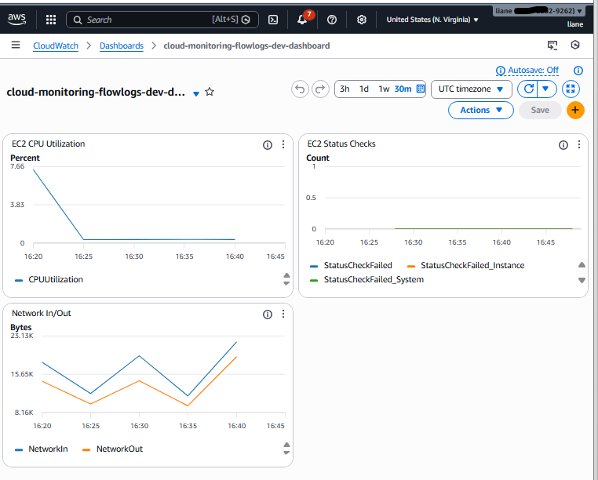

*Should show:* dashboard graphs for CPU, status checks, and network traffic.

---

### 5) Create CloudWatch alarms

**Goal:** detect issues early instead of waiting for users to report them.

I added alarms for:

* **high CPU**
* **status check failure**

This allows the environment to proactively alert me when instance health or performance crosses a threshold.

**Screenshot used in the project**

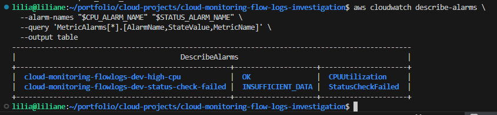

*Should show:* alarm names and their state such as OK or INSUFFICIENT_DATA.

---

### 6) Create a CloudWatch log group for Flow Logs

**Goal:** have a central place to store network traffic records for investigation.

I prepared CloudWatch Logs as the destination for VPC Flow Logs so network traffic would be searchable later in Logs Insights.

**Screenshot used in the project**

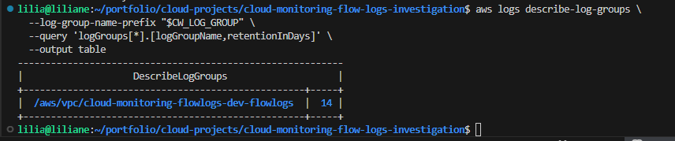

*Should show:* log group name and retention policy.

---

### 7) Create IAM permissions for VPC Flow Logs

**Goal:** allow the VPC Flow Logs service to publish logs into CloudWatch Logs.

To make the logging pipeline work, I created the IAM role and permissions required for Flow Logs delivery.

**Screenshot used in the project**

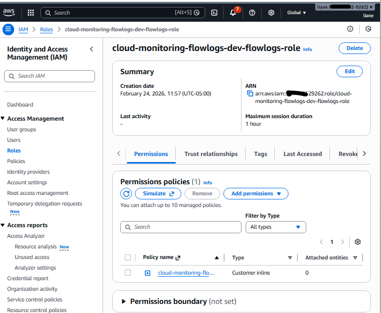

*Should show:* IAM role created and the role ARN.

---

### 8) Enable VPC Flow Logs

**Goal:** capture both accepted and rejected traffic for investigation.

I enabled VPC Flow Logs at the VPC level so I could see traffic decisions instead of guessing what the network allowed or blocked.

**Screenshot used in the project**

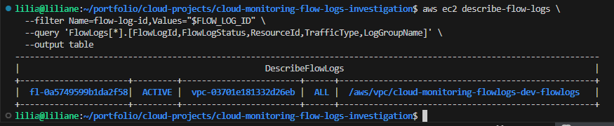

*Should show:* flow log status active and the destination log group.

---

### 9) Generate normal application traffic

**Goal:** confirm that real traffic is being captured and the environment is working before simulating failure.

I sent normal traffic to the app so I could verify that the endpoint was reachable and that traffic records were being generated.

**Screenshot used in the project**

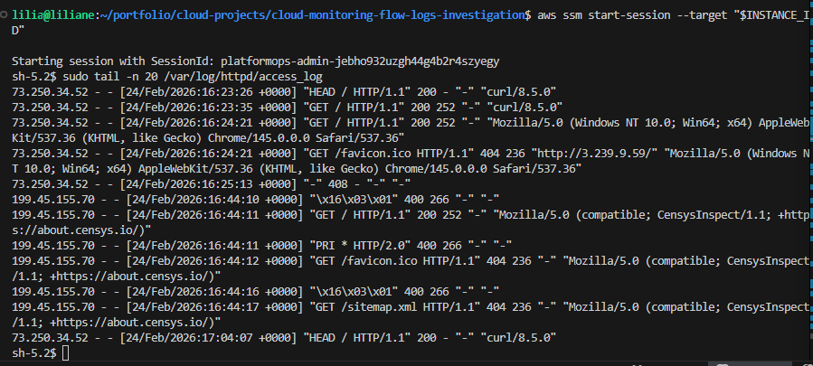

*Should show:* successful curl response and EC2 public IP.

---

### 10) Investigate logs in CloudWatch Logs Insights

**Goal:** confirm I can search and analyze flow log records in a useful way.

I used Logs Insights to review the latest traffic records and filter ACCEPT or REJECT events. This is where traffic troubleshooting becomes much faster than guessing from the instance side only.

**Screenshot used in the project**

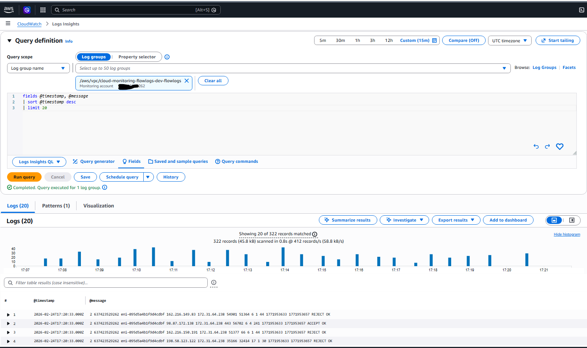

*Should show:* visible Flow Log records in Logs Insights, especially ACCEPT traffic.

---

### 11) Simulate a security group failure and investigate it

**Goal:** prove I can troubleshoot a real traffic-blocking issue from symptom to recovery.

To simulate a real outage, I removed the application port from the EC2 security group. From the user side, the application became unreachable. Then I used Flow Logs and Logs Insights to confirm rejected traffic and identify the issue. After that, I restored the security group rule and verified recovery.

**Screenshots used in the project**

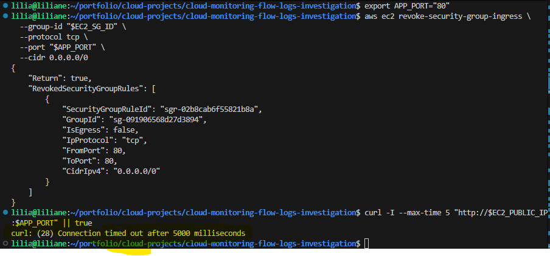

*Should show:* timeout or connection failure after access was blocked.

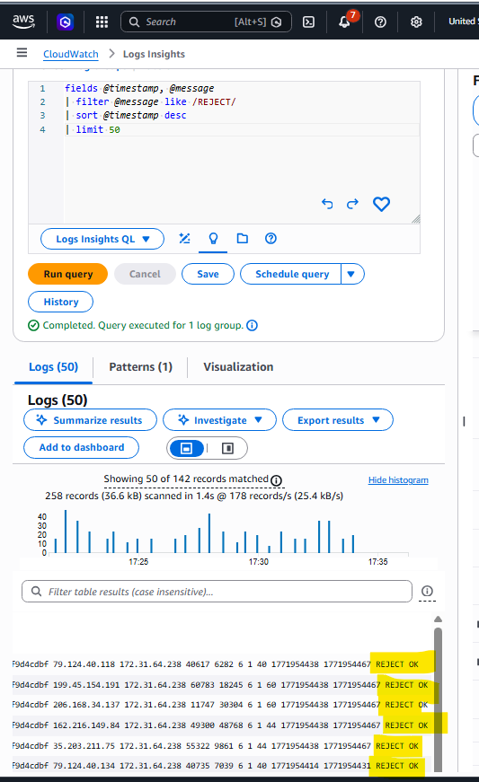

*Should show:* REJECT traffic visible in Flow Logs.

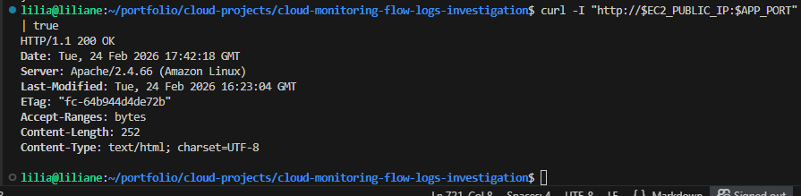

*Should show:* successful response after restoring the rule.

---

### 12) Trigger a CPU alarm and confirm alerting works

**Goal:** prove the alerting path works from metric threshold to notification.

I generated CPU load on the EC2 instance to trigger the CloudWatch alarm. This tested both the metric alarm itself and the SNS notification flow.

**Screenshots used in the project**

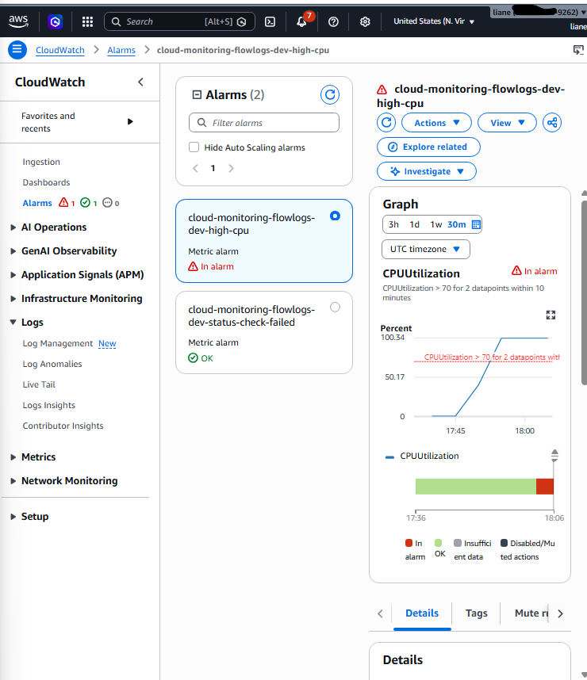

*Should show:* CPU alarm in ALARM state.

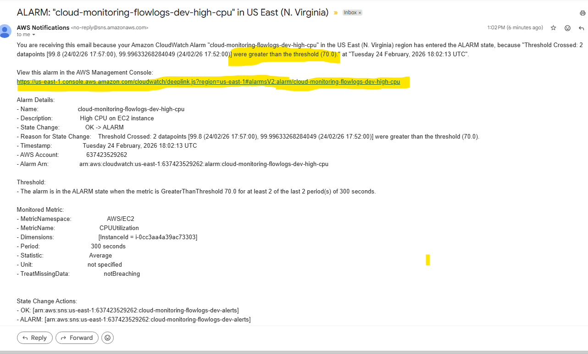

*Should show:* SNS email alert received.

---

## Business Impact

This project shows real operational value, not just setup work.

### What this project improves

* **faster troubleshooting**

  * I can quickly determine whether the problem is instance health, CPU pressure, or blocked traffic

* **better visibility**

  * dashboards and logs reduce guesswork during incidents

* **faster incident response**

  * alarms and notifications help me react before the issue becomes bigger

* **clear root-cause investigation**

  * VPC Flow Logs show whether traffic is being accepted or rejected

* **safer recovery**

  * after fixing the issue, I can validate recovery using monitoring, logs, and application checks

### Why this matters in a company

In a real business environment, this kind of setup helps reduce downtime, improve response time, and give engineering teams a repeatable process for diagnosing network-related application problems.

Instead of saying, “the app looks down,” I can show:

* what failed
* where it failed
* what traffic was blocked
* how I fixed it
* how I confirmed recovery

---

## Troubleshooting

### 1) No Flow Logs appear in CloudWatch Logs

**Possible causes**

* IAM role for Flow Logs is missing or incorrect
* wrong log group selected
* Flow Logs not active yet
* no traffic generated yet

**What I would check**

* Flow Log status
* IAM role and permissions
* log group existence
* whether traffic has actually been generated

---

### 2) Flow Logs exist but no REJECT records appear

**Possible causes**

* traffic is not reaching the VPC
* wrong port is being tested
* security group is still allowing traffic
* query is too strict

**What I would do**

* test again from the client side
* verify security group rules
* look at both ACCEPT and REJECT records
* widen the query to inspect recent traffic first

---

### 3) CPU alarm does not trigger

**Possible causes**

* threshold is too high
* not enough load is generated
* not enough time has passed for alarm evaluation

**What I would do**

* generate more CPU load
* wait for the evaluation period
* lower the threshold temporarily for demo purposes if needed

---

### 4) SNS email notification not received

**Possible causes**

* email subscription is still pending confirmation
* wrong email address used
* alarm has not entered ALARM state yet

**What I would do**

* verify subscription status
* confirm email subscription
* verify alarm state and alarm actions

---

### 5) Curl works one way but fails another way

**Possible causes**

* app is listening on a different port
* security group allows only one specific port
* test command is using the wrong URL or port

**What I would do**

* confirm the app listening port on EC2
* verify the security group inbound rule
* re-test with the correct port

---

## Useful CLI

### General verification

```bash
aws sts get-caller-identity
aws configure get region
aws ec2 describe-instances --instance-ids "$INSTANCE_ID" --output table
```

### Check EC2 public IP and app reachability

```bash
aws ec2 describe-instances \
  --instance-ids "$INSTANCE_ID" \
  --query 'Reservations[0].Instances[0].PublicIpAddress' \
  --output text

curl -I "http://$EC2_PUBLIC_IP"
curl "http://$EC2_PUBLIC_IP"
```

### Check CloudWatch alarms

```bash
aws cloudwatch describe-alarms \
  --alarm-names "$CPU_ALARM_NAME" "$STATUS_ALARM_NAME" \
  --output table
```

### Check SNS subscription

```bash
aws sns list-subscriptions-by-topic --topic-arn "$SNS_TOPIC_ARN"
```

### Check log groups

```bash
aws logs describe-log-groups \
  --log-group-name-prefix "$CW_LOG_GROUP" \
  --output table
```

### Check VPC Flow Logs

```bash
aws ec2 describe-flow-logs --flow-log-ids "$FLOW_LOG_ID" --output table
```

### Check IAM role for Flow Logs

```bash
aws iam get-role --role-name "$FLOWLOGS_ROLE_NAME"
```

### Troubleshooting CLI for security groups

```bash
aws ec2 describe-security-groups --group-ids "$EC2_SG_ID" --output table
```

### Troubleshooting CLI for EC2 status

```bash
aws ec2 describe-instance-status --instance-ids "$INSTANCE_ID" --output table
```

### Troubleshooting CLI for Logs Insights preparation

```bash
aws logs describe-log-streams \
  --log-group-name "$CW_LOG_GROUP" \
  --order-by LastEventTime \
  --descending
```

---

## Cleanup

After testing, I cleaned up the resources to avoid unnecessary cost.

### Cleanup items

* delete **VPC Flow Logs**
* delete **CloudWatch alarms**
* delete **CloudWatch dashboard**
* delete **SNS topic**
* delete **CloudWatch log group**
* delete **IAM role and inline policy for Flow Logs**
* terminate the **EC2 instance**
* remove any optional local helper files if they were created during setup

---

