# HA Web App (Load Balancer + Auto Scaling + Multi-AZ)

## Context

This project shows how I built a **high-availability web application on AWS** using:

* **Application Load Balancer (ALB)**
* **Auto Scaling Group (ASG)**
* **EC2 Launch Template**
* **Multi-AZ deployment** across **2 Availability Zones**

The goal of this project is to show that I can design a web tier that stays available even when an instance fails, becomes unhealthy, or traffic changes.

In real operations, high availability is important because users should still be able to access the application even if part of the infrastructure has a problem.

---

## Problem

A single EC2 instance is not enough for production-style availability.

### Real Ops Scenario

A team deploys a web app on one EC2 instance. At first, everything works. But later:

* the instance crashes
* the instance becomes unhealthy
* one Availability Zone has an issue
* traffic increases and one server cannot handle it

If the application depends on one server only, users experience downtime.

That creates risk for the business, hurts reliability, and makes operations more stressful during incidents.

---

## Solution

To solve this, I built an HA web layer using AWS services that work together:

* **ALB** distributes incoming traffic across healthy instances
* **ASG** keeps the desired number of instances running
* **Multi-AZ subnets** improve resilience across Availability Zones
* **Health checks** help detect unhealthy instances and replace them automatically

This means the application can continue serving users even if one instance fails.

---

## Architecture

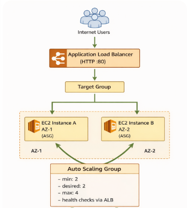

### Architecture Summary

* Users send requests to the **Application Load Balancer**
* The **ALB listener** forwards traffic to a **target group**
* The **target group** sends traffic only to **healthy EC2 instances**
* The **Auto Scaling Group** maintains the required number of EC2 instances
* Instances are distributed across **2 Availability Zones** for better resilience

> **Note:** For demo simplicity, the EC2 instances can be placed in public subnets. In a more production-grade design, I would place the app instances in **private subnets** and keep only the ALB public.

---

## Workflow

## 1. Confirm the AWS environment is ready

### Goal

Make sure I am working in the correct AWS account and region before creating anything.

This is important because creating HA infrastructure in the wrong account or region can cause confusion, cleanup issues, and unnecessary cost.

---

## 2. Verify Multi-AZ design

### Goal

Confirm that the region has multiple available Availability Zones so I can spread the application across them.

This is one of the key parts of high availability. If everything stays in only one AZ, the setup is not truly resilient.

### Screenshot

**Should show:** available AZs in the region.

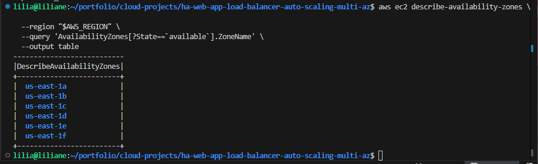

---

## 3. Build networking across multiple Availability Zones

### Goal

Create the network foundation so the application can run across two different subnets in two different AZs.

In this part, I make sure:

* the app has a VPC
* the subnets are placed in separate AZs
* internet routing is in place for the demo design

This step matters because the ALB and ASG need the network to be distributed correctly for failover and traffic flow.

### Screenshots

**Should show:** two subnets in different AZs.


**Should show:** route `0.0.0.0/0` to IGW.

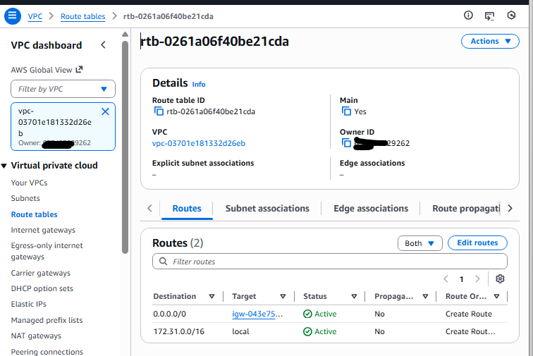

---

## 4. Secure traffic flow with security groups

### Goal

Control how traffic enters the load balancer and how traffic reaches the application instances.

Here, the design is:

* the **ALB** accepts HTTP traffic from users
* the **EC2 instances** accept traffic only from the **ALB security group**
* the app instances are not directly exposed to the internet

This improves security and keeps the traffic path clean.

### Screenshot

**Should show:** ALB SG and App SG rules.

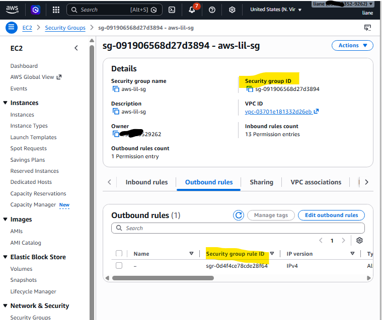

---

## 5. Prepare EC2 access and instance permissions

### Goal

Allow the instances to be managed in a safer way, especially for troubleshooting.

I used an EC2 role and instance profile so the instances can work with AWS services properly, and so I can manage them more cleanly without depending only on SSH access.

This is useful during troubleshooting because I may need to inspect instance behavior if health checks fail.

### Screenshot

**Should show:** EC2 role + instance profile + SSM policy.

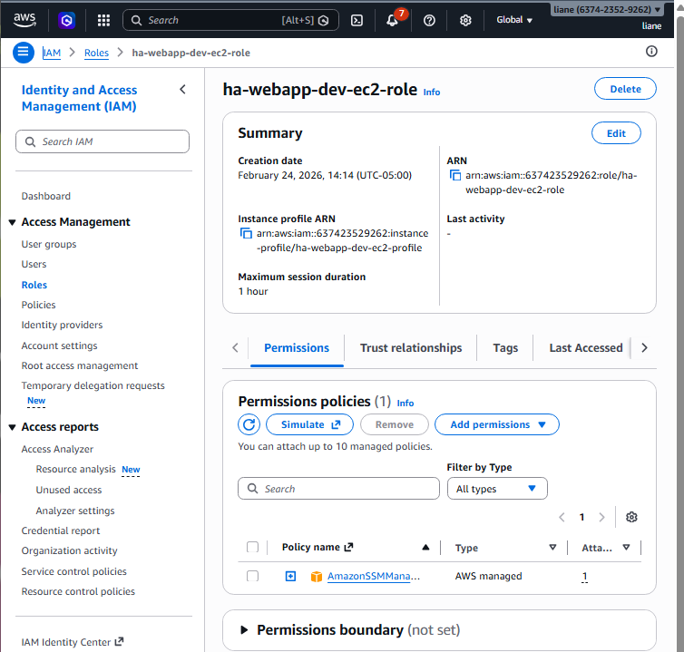

---

## 6. Standardize instance deployment with a launch template

### Goal

Create one reusable EC2 configuration so every instance launched by Auto Scaling is consistent.

This is important because replacement instances should behave the same way as the original ones. A launch template helps keep the AMI, instance type, permissions, and startup behavior standardized.

### Screenshot

**Should show:** launch template created.

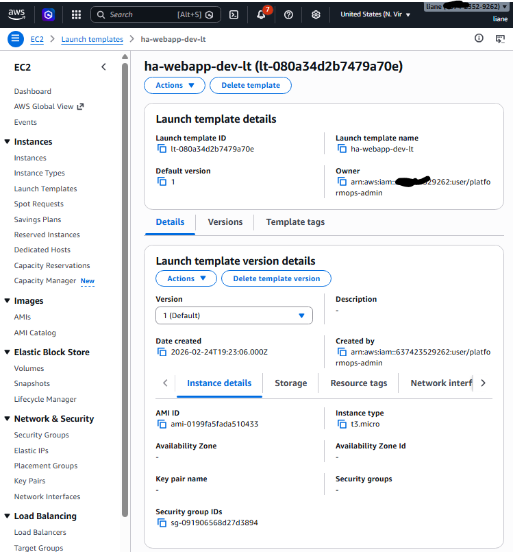

---

## 7. Create the load balancer entry point

### Goal

Set up the ALB so users have one stable endpoint instead of connecting to individual EC2 instances.

The ALB listens for incoming requests and forwards traffic to healthy targets only.

This is a major HA component because even if backend instances change, users continue using the same ALB endpoint.

### Screenshot

**Should show:** ALB active + HTTP listener.

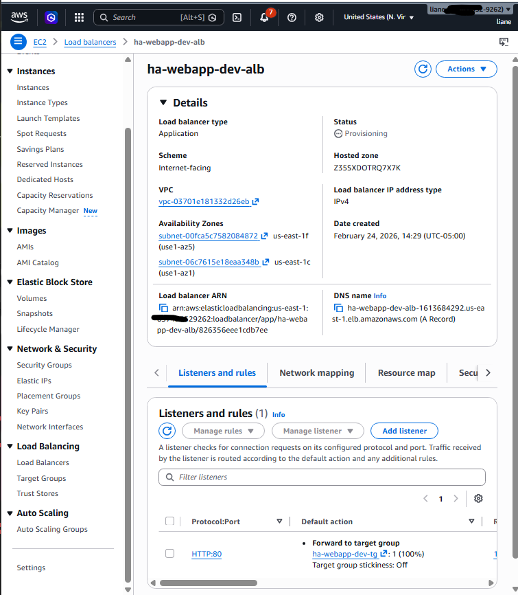

---

## 8. Create the Auto Scaling Group across 2 AZs

### Goal

Make sure the environment always keeps the expected number of instances running across multiple Availability Zones.

The ASG is what gives the environment self-healing behavior. If one instance dies, the group launches another one automatically.

### Screenshot

**Should show:** ASG desired/min/max and subnet list.

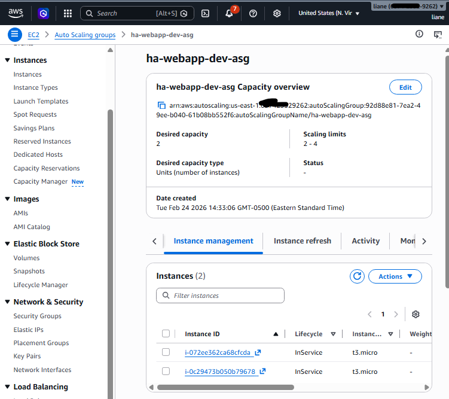

---

## 9. Confirm the targets are healthy

### Goal

Verify that the EC2 instances are registered properly and passing health checks before sending real traffic.

This is a critical validation step because the ALB should only forward traffic to healthy instances.

### Screenshot

**Should show:** two healthy targets.

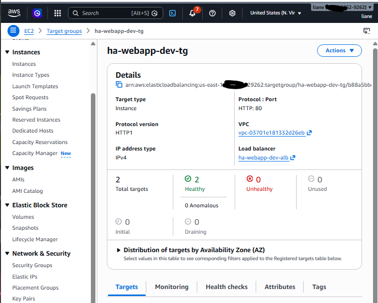

---

## 10. Validate the application through the load balancer

### Goal

Confirm that users can access the web app through the ALB endpoint.

At this stage, the HA path is working:

* request goes to ALB
* ALB checks healthy targets
* traffic is sent to available EC2 instances
* the app responds successfully

### Screenshot

**Should show:** app page via ALB DNS.

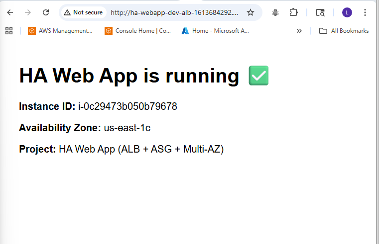

---

## 11. Simulate failure and verify auto-healing

### Goal

Prove that the environment can recover automatically when one instance fails.

This is the most important demo part of the project because it shows the real value of HA.

I simulate failure by terminating one EC2 instance, then I verify that:

* the ASG detects the loss
* a replacement instance is launched
* the target group becomes healthy again
* the app remains available through the ALB

### Screenshots

**Should show:** one instance terminated manually.

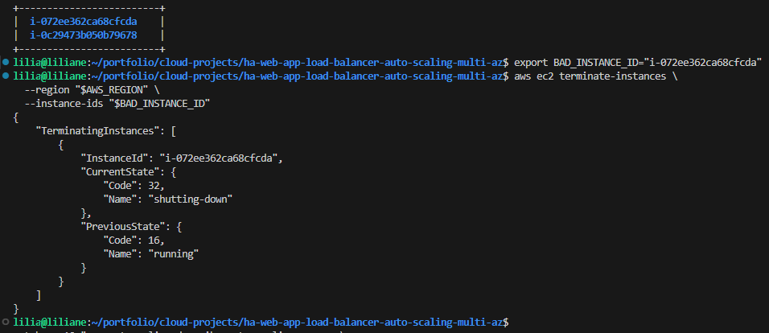

**Should show:** ASG launching replacement instance.

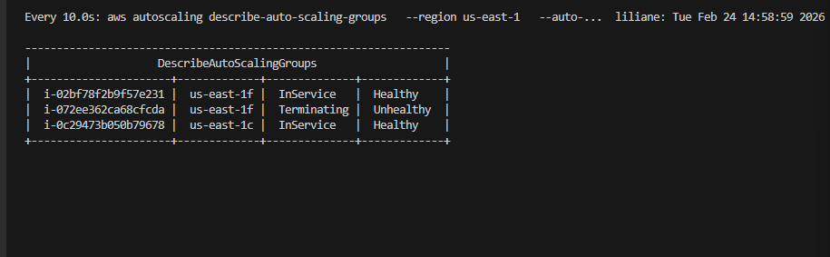

**Should show:** app still available after fail simulation.

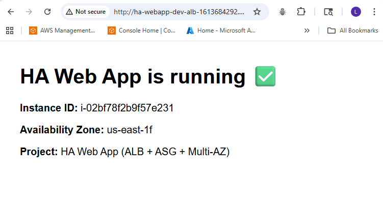

---

## Business Impact

This project matters because it demonstrates practical reliability design, not just basic EC2 deployment.

### What this setup improves

* **Higher availability**
  The application does not depend on one EC2 instance only.

* **Better resilience**
  If an instance fails, the system replaces it automatically.

* **Reduced downtime risk**
  Traffic continues through the load balancer while the backend recovers.

* **Operational confidence**
  Health checks and Auto Scaling make failure response faster and more predictable.

* **Production thinking**
  This project shows how I design for uptime, recovery, and service continuity instead of just “getting the app running.”

### Why this matters to a business

For a company, downtime can mean:

* lost users
* lost transactions
* poor customer experience
* more pressure on operations teams

With ALB + ASG + Multi-AZ, the service is more stable and easier to operate during incidents.

---

## Troubleshooting

## 1. ALB shows 503 or targets stay unhealthy

### Possible causes

* web server did not start
* application is not responding on port 80
* user data did not complete correctly
* EC2 security group does not allow traffic from the ALB security group

### What I check

* target health state
* instance status
* web server status on the EC2 instance
* cloud-init logs
* application response on localhost

---

## 2. Auto Scaling Group does not launch instances

### Possible causes

* launch template has a wrong AMI or config issue
* IAM instance profile is not ready yet
* subnet configuration is wrong
* EC2 quota or capacity issue in the region

### What I check

* Auto Scaling activities
* launch template settings
* subnet placement
* instance profile attachment
* EC2 error messages in scaling activity history

---

## 3. ALB DNS opens but request times out

### Possible causes

* ALB security group does not allow inbound port 80
* route table is missing internet route
* ALB is not fully active yet
* target group has no healthy instances

### What I check

* ALB status
* listener configuration
* route tables
* security group rules
* target group health

---

## 4. App works on instance but not through ALB

### Possible causes

* health check path is wrong
* app is listening on a different port
* security groups are not linked correctly
* target group matcher does not match the app response

### What I check

* target group health check settings
* app local response
* ALB listener forwarding rule
* instance security group inbound source

---

## Useful CLI

These are the main CLI commands I would use for **validation and troubleshooting** in this project.

### Confirm AWS identity

```bash
aws sts get-caller-identity
```

### Check Auto Scaling Group instances

```bash
aws autoscaling describe-auto-scaling-groups \
  --region "$AWS_REGION" \
  --auto-scaling-group-names "$ASG_NAME" \
  --query 'AutoScalingGroups[0].Instances[*].[InstanceId,AvailabilityZone,LifecycleState,HealthStatus]' \
  --output table
```

### Check target group health

```bash
aws elbv2 describe-target-health \
  --region "$AWS_REGION" \
  --target-group-arn "$TG_ARN" \
  --query 'TargetHealthDescriptions[*].[Target.Id,TargetHealth.State,TargetHealth.Reason]' \
  --output table
```

### Check scaling activity history

```bash
aws autoscaling describe-scaling-activities \
  --region "$AWS_REGION" \
  --auto-scaling-group-name "$ASG_NAME" \
  --max-items 10
```

### Check ALB status

```bash
aws elbv2 describe-load-balancers \
  --region "$AWS_REGION" \
  --load-balancer-arns "$ALB_ARN"
```

### Check route table

```bash
aws ec2 describe-route-tables \
  --region "$AWS_REGION" \
  --route-table-ids "$RTB_ID"
```

### Check security groups

```bash
aws ec2 describe-security-groups \
  --region "$AWS_REGION" \
  --group-ids "$ALB_SG_ID" "$APP_SG_ID"
```

### Find running EC2 instances for the project

```bash
aws ec2 describe-instances \
  --region "$AWS_REGION" \
  --filters "Name=tag:Project,Values=$PROJECT" "Name=instance-state-name,Values=running" \
  --query 'Reservations[*].Instances[*].[InstanceId,PrivateIpAddress,PublicIpAddress,Placement.AvailabilityZone]' \
  --output table
```

### Start SSM session to troubleshoot an instance

```bash
aws ssm start-session \
  --region "$AWS_REGION" \
  --target <instance-id>
```

### On the EC2 instance, check web server status

```bash
sudo systemctl status httpd
sudo journalctl -u httpd --no-pager | tail -50
sudo cat /var/log/cloud-init-output.log | tail -100
curl -I http://localhost
```

### Test the ALB endpoint

```bash
curl -I "http://$ALB_DNS"
```

---

## Cleanup

I always include cleanup because AWS resources can continue generating cost if I leave them running.

### Recommended cleanup order

1. Delete or scale down the **Auto Scaling Group**
2. Delete the **ALB listener**
3. Delete the **Application Load Balancer**
4. Delete the **target group**
5. Delete the **launch template**
6. Delete the **security groups**
7. Remove the **instance profile and IAM role**
8. Delete the **route table**
9. Detach and delete the **Internet Gateway**
10. Delete the **subnets**
11. Delete the **VPC**

### Cleanup note

The deletion order matters because some resources depend on others.
For example:

* a VPC cannot be deleted while subnets still exist
* a security group may fail to delete if it is still attached
* a target group may fail to delete if the ALB still references it

---
