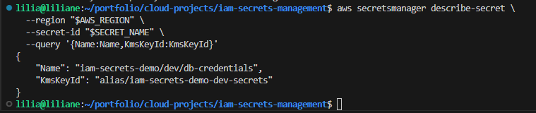

# IAM + Secrets Management

## Context

I built this project to show how I secure application secrets in AWS **without hardcoding credentials** in code, servers, or CI/CD jobs.

In real environments, applications often need sensitive values like:

* database passwords
* API keys
* third-party tokens
* internal service credentials

A secure setup should make sure those secrets are **stored safely**, **encrypted**, and **only accessible to the right workload**.

In this project, I use:

* **IAM least privilege**
* **AWS Secrets Manager**
* **EC2 IAM Role**
* **AWS KMS**
* **SSM Session Manager**

What happens in this design:

* I send the plain secret to **AWS Secrets Manager**
* **Secrets Manager** uses **KMS** to encrypt it at rest
* When an allowed app or role reads it, AWS decrypts it securely and returns it
* The application gets access through an **IAM role**, not through hardcoded credentials

---

## Problem

In many teams, secrets are still handled in risky ways, such as:

* putting passwords in `.env` files
* storing secrets in GitHub repositories
* sharing credentials in chat
* giving users or systems very broad IAM permissions

That creates serious security and audit risks.

### Real Ops Scenario

I deploy an application on EC2, and the app needs a database password or API key.

I do **not** want to:

* hardcode the secret in the application
* SSH into the server and manually paste credentials
* give every IAM user permission to read production secrets

I need a secure setup where:

* the **EC2 application** can read only its own secret
* a **normal IAM user without permission** cannot read that secret
* the secret is encrypted and managed properly
* access is traceable and controlled

---

## Solution

I built a secure secret-access pattern in AWS using:

1. **Secrets Manager** to store the application secret securely
2. **KMS** to encrypt the secret at rest
3. **IAM least privilege policy** so access is limited to only the required secret
4. **EC2 IAM role** so the instance can read the secret without static credentials
5. **SSM Session Manager** so I can access the instance without managing SSH keys
6. **Validation tests** to prove:

   * the EC2 role can read the secret
   * an unauthorized IAM user gets denied

This gives me a reusable DevSecOps pattern for secure application access to secrets.

---

## Architecture


---

## Workflow With Goals

### 1. Identity and environment foundation

**Goal:** confirm I am working in the correct AWS account and project context before creating security resources.

At this stage, I verify the AWS identity and set the naming foundation for the demo so every resource is organized and easy to track.

**Screenshot:**


---

### 2. KMS key for encryption

**Goal:** create the encryption layer that protects the secret at rest.

I create a customer-managed KMS key and alias so the secret is not just stored, but also encrypted using a key I control.

**Screenshot:**


---

### 3. Secret stored in Secrets Manager

**Goal:** move the secret out of code and into a secure AWS-managed service.

Instead of storing a password in application files or manually placing it on the server, I store the secret in Secrets Manager and link it to the KMS encryption key.

**Screenshot:**


---

### 4. IAM least-privilege policy

**Goal:** restrict access so only the intended workload can read the secret.

I create a policy that allows access only to the required secret, instead of giving broad access to all secrets in the account.

**Screenshot:**


---

### 5. EC2 role and instance profile

**Goal:** give the application a secure identity through IAM instead of static credentials.

I attach the secret-read permissions to an EC2 role and instance profile so the application can authenticate securely through AWS.

**Screenshot:**


---

### 6. Security group for the instance

**Goal:** keep the instance network exposure minimal.

Because I use SSM Session Manager for access, I do not need to rely on open SSH access for the demo. This keeps the instance setup cleaner and more secure.

**Screenshot:**


---

### 7. EC2 instance launched with IAM role

**Goal:** run the application on infrastructure that already has secure secret access built in.

I launch the EC2 instance with the IAM role attached so the workload can securely request its secret from AWS.

**Screenshot:**


---

### 8. Secure access with SSM Session Manager

**Goal:** access the instance for administration and testing without using SSH keys.

I connect using SSM Session Manager, which is a safer and more manageable way to access the EC2 instance during the demo.

**Screenshot:**


---

### 9. Secret retrieval from EC2

**Goal:** prove the application path works securely.

From the EC2 instance, I retrieve the secret successfully using the attached IAM role. This shows that the workload can access the secret without storing any password locally.

**Screenshot:**


---

### 10. Validation tests

**Goal:** prove both security and least privilege are working correctly.

I validate the design by testing different access paths:

* **EC2 role succeeds** in reading the secret
* **unauthorized IAM user fails** with access denied
* **KMS encryption metadata is present**
* **secret update/rotation works** without changing the app access model

**Screenshots:**





---

## Business Impact

This project demonstrates a secure pattern that is useful in real production environments.

### Why it matters

* **Removes secrets from code**
  Applications do not need hardcoded passwords or API keys.

* **Reduces security risk**
  Sensitive values are stored in Secrets Manager instead of GitHub, local files, or chat messages.

* **Improves access control**
  Only the EC2 workload with the correct IAM role can read the secret.

* **Supports audit and compliance**
  Secret access is managed through AWS IAM and can be tracked more clearly.

* **Improves operational safety**
  Teams can rotate or update secrets without changing code or manually logging into servers.

### Real-world value

This pattern can be reused for:

* database credentials
* API tokens
* internal service authentication
* application configuration secrets across dev, staging, and production

---

## Troubleshooting

### EC2 cannot read the secret

**Possible causes:**

* IAM role is not attached correctly
* secret-read policy is missing or incorrect
* KMS decrypt permission is missing
* IAM changes have not fully propagated yet

**What to check:**

* instance profile attached to EC2
* correct policy attached to the role
* secret ARN matches the policy scope
* KMS permissions allow decrypt through Secrets Manager

---

### SSM session does not connect

**Possible causes:**

* EC2 role is missing the SSM managed policy
* SSM agent is not active
* instance is still initializing
* instance does not have the required network path to SSM services

**What to check:**

* role has SSM permissions
* instance is fully running
* SSM agent is online
* networking allows communication to SSM endpoints

---

### Unauthorized user can still access the secret

**Possible causes:**

* wrong AWS profile used during testing
* user has broader IAM permissions than expected
* secret policy or identity policy is too open

**What to check:**

* caller identity of the current session
* attached policies for the IAM user
* whether access is coming from another role/profile

---

### Secret not found

**Possible causes:**

* wrong secret name
* wrong region
* secret was deleted or recreated under a different name

**What to check:**

* exact secret name
* active AWS region
* secret metadata in Secrets Manager

---

### KMS alias or key conflicts

**Possible causes:**

* alias name already exists from a previous test
* old resources were not cleaned up

**What to check:**

* existing aliases
* old KMS resources from previous runs

---

## Useful CLI

These are useful commands for verification, troubleshooting, and cleanup.

### Identity and verification

```bash
aws sts get-caller-identity
```

```bash
aws secretsmanager describe-secret --secret-id <secret-name> --region <region>
```

```bash
aws secretsmanager list-secrets --region <region>
```

---

### EC2 and IAM checks

```bash
aws ec2 describe-instances --instance-ids <instance-id> --region <region>
```

```bash
aws iam list-attached-role-policies --role-name <role-name>
```

```bash
aws iam get-instance-profile --instance-profile-name <instance-profile-name>
```

---

### SSM troubleshooting

```bash
aws ssm describe-instance-information --region <region>
```

```bash
aws ssm start-session --target <instance-id> --region <region>
```

---

### Secret access testing

```bash
aws secretsmanager get-secret-value --secret-id <secret-name> --region <region>
```

```bash
aws secretsmanager describe-secret --secret-id <secret-name> --region <region> --query '{Name:Name,KmsKeyId:KmsKeyId}'
```

---

### KMS troubleshooting

```bash
aws kms list-aliases --region <region>
```

```bash
aws kms describe-key --key-id <key-id> --region <region>
```

---

### IAM user/profile troubleshooting

```bash
aws configure list
```

```bash
aws sts get-caller-identity --profile <profile-name>
```

---

## Cleanup

When the demo is finished, I remove the temporary resources to avoid unnecessary charges and keep the account clean.

Cleanup includes:

* terminating the EC2 instance
* deleting the security group
* removing the IAM role and instance profile
* deleting the custom IAM policy
* deleting the secret
* deleting the KMS alias
* scheduling the KMS key for deletion

This makes the project safe to run as a demo without leaving unused resources behind.

---
