````markdown
# IAM + Secrets Management (Least Privilege + Secure App Access)

## Purpose

This project shows how I secure application secrets in AWS **without hardcoding credentials** in code, servers, or CI/CD jobs.

I use:

- **IAM least privilege** (users/roles get only what they need)
- **AWS Secrets Manager** (store secrets securely)
- **EC2 IAM Role** (application reads secret securely)
- **AWS KMS** (encryption at rest for the secret)

What happens : 

  - You send the plain secret to AWS Secrets Manager

  - Secrets Manager uses KMS to encrypt it when storing it

  - When an allowed app/role reads it, AWS decrypts it (using KMS) and returns it securely

---

## Problem

In many teams, people still do risky things like:

- putting database passwords in `.env` files
- storing secrets in GitHub repos
- sharing credentials in chat
- giving broad IAM permissions like `AdministratorAccess`

That creates security risks and audit problems.

### Real “Ops” Scenario (simple)
I deploy a Node.js app on EC2. The app needs a database password (or API key).  
I do **not** want to:

- hardcode the password in the app
- SSH into the server and manually paste secrets
- let every IAM user read production secrets

I need a secure design where:

- the **EC2 app** can read only its own secret
- a **normal IAM user** cannot read that secret
- everything is encrypted and traceable

---

## Solution

I build a secure pattern using:

1. **Secrets Manager** to store the application secret
2. **KMS key** to encrypt the secret
3. **IAM policy** with least privilege (`GetSecretValue` for only one secret)
4. **EC2 IAM role** attached to the instance profile
5. **SSM Session Manager** for access (no SSH key required, optional but recommended)
6. **Testing** to prove:
   - ✅ EC2 role can read the secret
   - ❌ IAM user without permission cannot read the secret


---

## Architecture Diagram

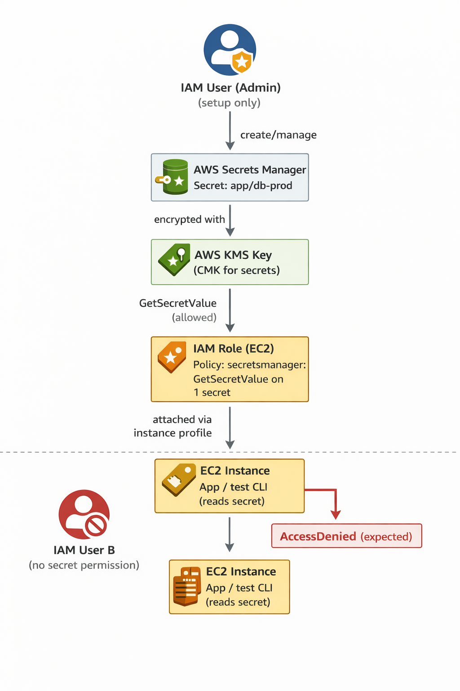

---

## Step-by-step CLI (with variable assignments)


> I use **AWS CLI** and **SSM** so I don’t need SSH keys for the demo.

### Step 1 — Set variables (foundation)

**Purpose:** Keep commands reusable and clean.

```bash
# ===== Global =====
export AWS_REGION="us-east-1"
export ACCOUNT_ID="$(aws sts get-caller-identity --query Account --output text)"

# ===== Naming =====
export PROJECT_NAME="iam-secrets-demo"
export ENV_NAME="dev"

# ===== Secret =====
export SECRET_NAME="${PROJECT_NAME}/${ENV_NAME}/db-credentials"
export SECRET_DESCRIPTION="Demo DB credentials for app running on EC2"

# ===== KMS =====
export KMS_ALIAS="alias/${PROJECT_NAME}-${ENV_NAME}-secrets"

# ===== IAM =====
export EC2_ROLE_NAME="${PROJECT_NAME}-${ENV_NAME}-ec2-role"
export EC2_POLICY_NAME="${PROJECT_NAME}-${ENV_NAME}-secrets-read-policy"
export EC2_INSTANCE_PROFILE_NAME="${PROJECT_NAME}-${ENV_NAME}-instance-profile"

# ===== EC2 / Networking =====
export AMI_ID="$(aws ssm get-parameter \
  --name /aws/service/ami-amazon-linux-latest/al2023-ami-kernel-default-x86_64 \
  --region $AWS_REGION \
  --query 'Parameter.Value' \
  --output text)"
export INSTANCE_TYPE="t3.micro"

# Use default VPC for quick demo (for production, use your own VPC/subnets)
export DEFAULT_VPC_ID="$(aws ec2 describe-vpcs \
  --region $AWS_REGION \
  --filters Name=isDefault,Values=true \
  --query 'Vpcs[0].VpcId' --output text)"

export PUBLIC_SUBNET_ID="$(aws ec2 describe-subnets \
  --region $AWS_REGION \
  --filters Name=vpc-id,Values=$DEFAULT_VPC_ID Name=default-for-az,Values=true \
  --query 'Subnets[0].SubnetId' --output text)"

# ===== Security group =====
export EC2_SG_NAME="${PROJECT_NAME}-${ENV_NAME}-sg"
```

**Screenshot to attach to step**

* `screenshots/01-variables-and-sts.png`
* **Should show:** `aws sts get-caller-identity` output + exported variables (at least `ACCOUNT_ID`, `AWS_REGION`)
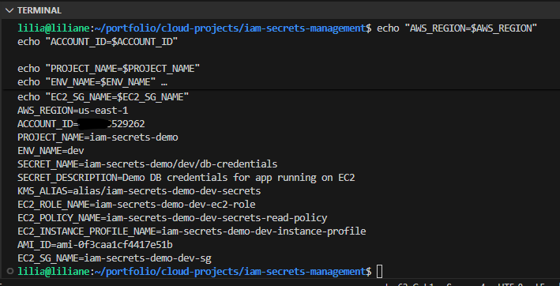

---

### Step 2 — Create KMS key and alias (encryption)

**Purpose:** Encrypt secrets at rest with a customer-managed KMS key.

#### 2.1 Create KMS key

```bash
export KMS_KEY_ID="$(aws kms create-key \
  --region $AWS_REGION \
  --description "${PROJECT_NAME} ${ENV_NAME} Secrets KMS key" \
  --query 'KeyMetadata.KeyId' \
  --output text)"
echo "$KMS_KEY_ID"  #→ tells Secrets Manager which KMS key to use for
```

#### 2.2 Create alias for easier reference

```bash
aws kms create-alias \
  --region $AWS_REGION \
  --alias-name "$KMS_ALIAS" \
  --target-key-id "$KMS_KEY_ID"
```

#### 2.3 Verify

```bash
aws kms list-aliases --region $AWS_REGION \
  --query "Aliases[?AliasName=='$KMS_ALIAS'].[AliasName,TargetKeyId]" \
  --output table
```

**Screenshot to attach to step**

* `screenshots/02-kms-key-alias-created.png`
* **Should show:** KMS alias mapped to key ID
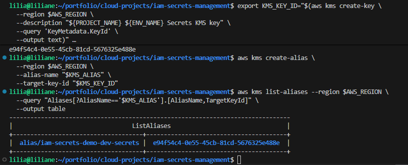

---

### Step 3 — Create secret in Secrets Manager

**Purpose:** Store secret securely (instead of hardcoding in code or env file).

#### 3.1 Create secret JSON locally

```bash
cat > secret-string.json <<EOF
{
  "username": "app_user",
  "password": "SuperSecureDemoPassword123!",
  "engine": "postgres",
  "host": "demo-db.internal",
  "port": "5432",
  "dbname": "appdb"
}
EOF
```

#### 3.2 Create secret using KMS key

```bash
aws secretsmanager create-secret \
  --region $AWS_REGION \
  --name "$SECRET_NAME" \
  --description "$SECRET_DESCRIPTION" \
  --kms-key-id "$KMS_ALIAS" \
  --secret-string file://secret-string.json
```

#### 3.3 Save secret ARN (used later in IAM policy)

```bash
export SECRET_ARN="$(aws secretsmanager describe-secret \
  --region $AWS_REGION \
  --secret-id "$SECRET_NAME" \
  --query 'ARN' --output text)"
echo "$SECRET_ARN"
```

#### 3.4 Verify (metadata only, not the value)

```bash
aws secretsmanager describe-secret \
  --region $AWS_REGION \
  --secret-id "$SECRET_NAME" \
  --query '{Name:Name,ARN:ARN,KmsKeyId:KmsKeyId}' \
  --output table
```

**Screenshot to attach to step**

* `screenshots/03-secret-created-metadata.png`
* **Should show:** secret name/ARN and KMS key ID (metadata only)
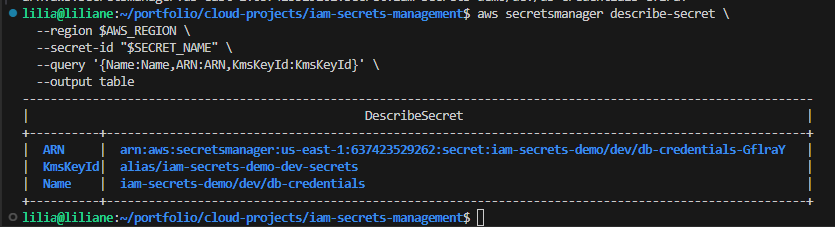
---

### Step 4 — Create IAM policy (least privilege for one secret)

**Purpose:** Allow EC2 role to read only this secret, not all secrets.

#### 4.1 Create policy JSON

```bash
cat > ec2-secrets-read-policy.json <<EOF
{
  "Version": "2012-10-17",
  "Statement": [
    {
      "Sid": "ReadOnlySpecificSecret",
      "Effect": "Allow",
      "Action": [
        "secretsmanager:GetSecretValue",
        "secretsmanager:DescribeSecret"
      ],
      "Resource": "$SECRET_ARN"
    },
    {
      "Sid": "DecryptSecretWithKMS",
      "Effect": "Allow",
      "Action": [
        "kms:Decrypt"
      ],
      "Resource": "*",
      "Condition": {
        "StringEquals": {
          "kms:ViaService": "secretsmanager.${AWS_REGION}.amazonaws.com"
        }
      }
    }
  ]
}
EOF
```

> In production, I can restrict the KMS key resource to the exact key ARN. For demo speed, I use `Resource: "*"` with `kms:ViaService` condition.

#### 4.2 Create IAM managed policy

```bash
aws iam create-policy \
  --policy-name "$EC2_POLICY_NAME" \
  --policy-document file://ec2-secrets-read-policy.json
```

#### 4.3 Save policy ARN

```bash
export EC2_POLICY_ARN="$(aws iam list-policies --scope Local \
  --query "Policies[?PolicyName=='$EC2_POLICY_NAME'].Arn | [0]" \
  --output text)"
echo "$EC2_POLICY_ARN"
```

**Screenshot to attach to step**

* `screenshots/04-iam-policy-created.png`
* **Should show:** policy ARN and/or IAM console page showing policy attached later

---

### Step 5 — Create IAM role for EC2 + instance profile

**Purpose:** Give the EC2 instance permission via role (not static access keys).

#### 5.1 Create trust policy for EC2

```bash
cat > trust-ec2.json <<EOF
{
  "Version": "2012-10-17",
  "Statement": [
    {
      "Effect": "Allow",
      "Principal": { "Service": "ec2.amazonaws.com" },
      "Action": "sts:AssumeRole"
    }
  ]
}
EOF
```

#### 5.2 Create role

```bash
aws iam create-role \
  --role-name "$EC2_ROLE_NAME" \
  --assume-role-policy-document file://trust-ec2.json
```

#### 5.3 Attach custom secret-read policy

```bash
aws iam attach-role-policy \
  --role-name "$EC2_ROLE_NAME" \
  --policy-arn "$EC2_POLICY_ARN"
```

#### 5.4 Attach SSM managed policy (for Session Manager access)

```bash
aws iam attach-role-policy \
  --role-name "$EC2_ROLE_NAME" \
  --policy-arn "arn:aws:iam::aws:policy/AmazonSSMManagedInstanceCore"
```

#### 5.5 Create instance profile and add role

```bash
aws iam create-instance-profile \
  --instance-profile-name "$EC2_INSTANCE_PROFILE_NAME"

aws iam add-role-to-instance-profile \
  --instance-profile-name "$EC2_INSTANCE_PROFILE_NAME" \
  --role-name "$EC2_ROLE_NAME"
```

#### 5.6 Wait for IAM propagation (important)

```bash
sleep 15
```

**Screenshot to attach to step**

* `screenshots/05-ec2-role-instance-profile.png`
* **Should show:** IAM role with attached policies + instance profile
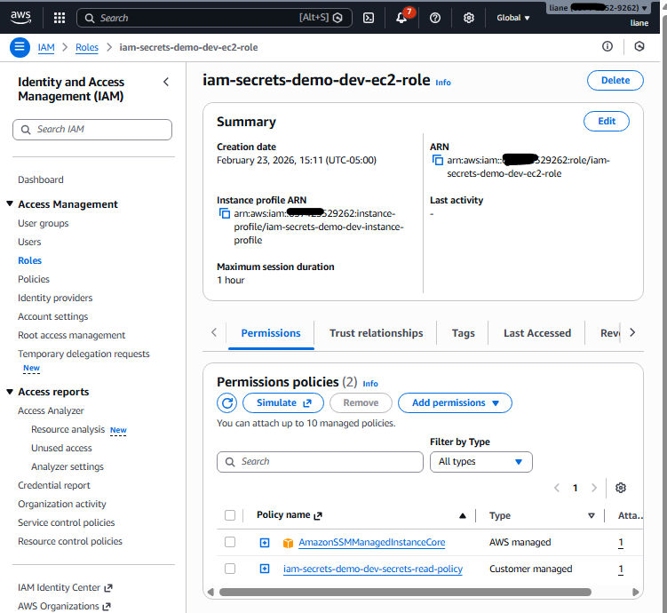

---

### Step 6 — Create security group for EC2

**Purpose:** Minimal network access for demo.
(Using SSM means I don’t need SSH open on port 22.)

```bash
export EC2_SG_ID="$(aws ec2 create-security-group \
  --region $AWS_REGION \
  --group-name "$EC2_SG_NAME" \
  --description "EC2 SG for ${PROJECT_NAME}" \
  --vpc-id "$DEFAULT_VPC_ID" \
  --query 'GroupId' \
  --output text)"
echo "$EC2_SG_ID"
```

Allow outbound (default usually exists). No inbound required for SSM-only demo.

* **Inbound** = traffic **coming into**  server/resource (example: users visiting website on port 80/443).
* **Outbound** = traffic **going out from** server/resource (example: server calling an API or downloading updates).


**Screenshot to attach to step**

* `screenshots/06-ec2-security-group.png`
* **Should show:** SG created with no inbound SSH rule (or minimal rules)
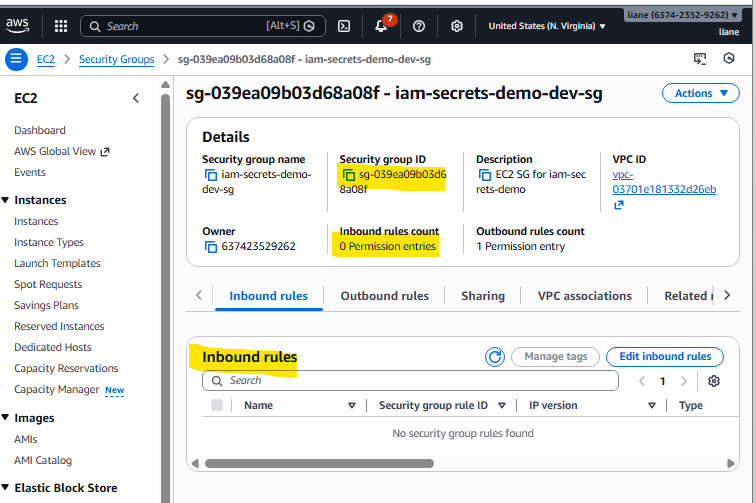

---

### Step 7 — Launch EC2 instance with IAM role

**Purpose:** Run app/test commands on an instance that can securely read the secret.

#### 7.1 User data (install AWS CLI jq)

```bash
cat > user-data.sh <<'EOF'
#!/bin/bash
dnf update -y
dnf install -y jq
systemctl enable amazon-ssm-agent
systemctl start amazon-ssm-agent
EOF
```

#### 7.2 Launch instance

```bash
export INSTANCE_ID="$(aws ec2 run-instances \
  --region $AWS_REGION \
  --image-id "$AMI_ID" \
  --instance-type "$INSTANCE_TYPE" \
  --subnet-id "$PUBLIC_SUBNET_ID" \
  --security-group-ids "$EC2_SG_ID" \
  --iam-instance-profile Name="$EC2_INSTANCE_PROFILE_NAME" \
  --user-data file://user-data.sh \
  --tag-specifications "ResourceType=instance,Tags=[{Key=Name,Value=${PROJECT_NAME}-${ENV_NAME}-ec2}]" \
  --query 'Instances[0].InstanceId' \
  --output text)"
echo "$INSTANCE_ID"
```

#### 7.3 Wait for instance running + status checks

```bash
aws ec2 wait instance-running --region $AWS_REGION --instance-ids "$INSTANCE_ID"
aws ec2 wait instance-status-ok --region $AWS_REGION --instance-ids "$INSTANCE_ID"
echo "EC2 is ready: $INSTANCE_ID"
```

**Screenshot to attach to step**

* `screenshots/07-ec2-running-with-role.png`
* **Should show:** EC2 instance running + IAM role attached in instance details
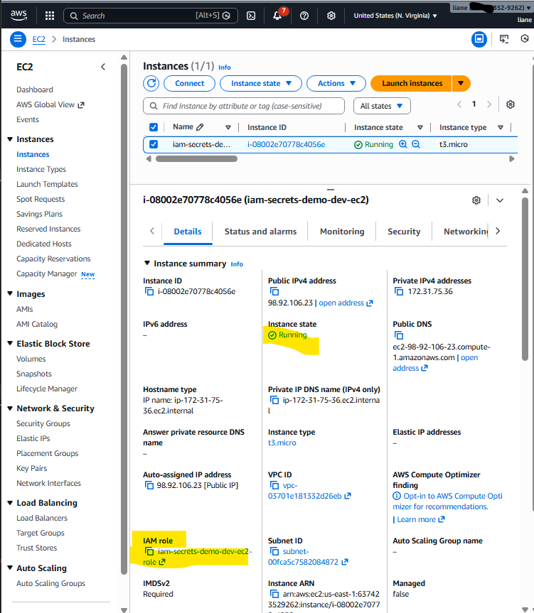
---

### Step 8 — Connect to EC2 using SSM Session Manager

**Purpose:** Access the server without SSH keys (more secure and easier for demo).

```bash
aws ssm start-session \
  --region $AWS_REGION \
  --target "$INSTANCE_ID"
```

> If session fails, wait 1–2 minutes for SSM agent/role propagation and try again.

**Screenshot to attach to step**

* `screenshots/08-ssm-session-open.png`
* **Should show:** active SSM shell session on EC2
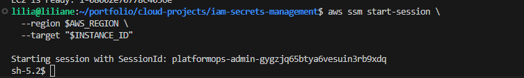
---

### Step 9 — Read secret from EC2 (application behavior simulation)

**Purpose:** Prove the EC2 role can read the secret securely.

Run **inside the EC2 SSM session**:

```bash
# confirm instance role credentials are available
curl -s http://169.254.169.254/latest/meta-data/iam/security-credentials/ || true

# get secret value
aws secretsmanager get-secret-value \
  --region "$AWS_REGION" \
  --secret-id "$SECRET_NAME" \
  --query 'SecretString' \
  --output text
```

Optional (parse JSON):

```bash
aws secretsmanager get-secret-value \
  --region "$AWS_REGION" \
  --secret-id "$SECRET_NAME" \
  --query 'SecretString' \
  --output text | jq .
```

**Screenshot to attach to step**

* `screenshots/09-ec2-read-secret-success.png`
* **Should show:** successful `get-secret-value` from EC2 
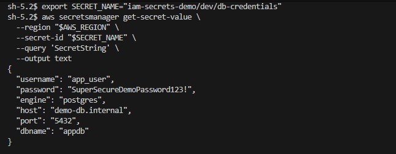
---

## Testing

This is the most important because it proves the security design works.

---

### ✅ Test 1 — EC2 instance role can read the secret (expected success)

**Purpose:** Prove the app/server can access the secret using IAM role (no static credentials).

Run on EC2 (via SSM):

```bash
aws sts get-caller-identity
aws secretsmanager get-secret-value \
  --region "$AWS_REGION" \
  --secret-id "$SECRET_NAME" \
  --query 'Name' \
  --output text
```

**Expected result**

* `aws sts get-caller-identity` shows an **assumed role** (EC2 role)
* `get-secret-value` succeeds

**Screenshot**

* `screenshots/10-test1-ec2-role-success.png`
* **Should show:** caller identity is assumed role + secret read success
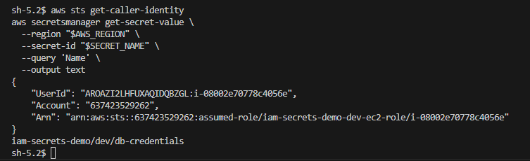
---

### ❌ Test 2 — IAM user without permission cannot read the secret (expected AccessDenied)

**Purpose:** Prove least privilege is enforced.

> Run this on your local machine using a profile for a user that does **not** have Secrets Manager permission (for example `user-b`).

```bash
export AWS_PROFILE="user-b"

aws sts get-caller-identity --profile user-b

aws secretsmanager get-secret-value \
  --profile user-b \
  --region us-east-1 \
  --secret-id "iam-secrets-demo/dev/db-credentials"
```

**Expected result**

* `aws sts get-caller-identity` shows **IAM User B**
* `get-secret-value` returns **AccessDeniedException**

**Screenshot**

* `screenshots/11-test2-userb-accessdenied.png`
* **Should show:** caller identity = user B + AccessDenied error
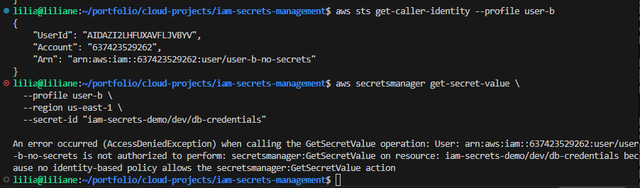
---

### ✅ Test 3 — Secret is encrypted with KMS key (metadata validation)

**Purpose:** Prove encryption-at-rest is configured correctly.

```bash
unset AWS_PROFILE  # or switch back to admin profile with permissions
aws secretsmanager describe-secret \
  --region "$AWS_REGION" \
  --secret-id "$SECRET_NAME" \
  --query '{Name:Name,KmsKeyId:KmsKeyId}'
```

**Expected result**

* `KmsKeyId` is your custom key/alias (not default key)

**Screenshot**

* `screenshots/12-test3-kms-encryption-check.png`
* **Should show:** secret metadata with KMS key ID

---

### ✅ Test 4 — Rotate/update secret value (operational change) and verify app path still works

**Purpose:** Show ops-ready workflow (change secret without changing code).

#### 4.1 Update secret

```bash
cat > secret-string-v2.json <<EOF
{
  "username": "app_user",
  "password": "NewRotatedPassword456!",
  "engine": "postgres",
  "host": "demo-db.internal",
  "port": "5432",
  "dbname": "appdb"
}
EOF

aws secretsmanager update-secret \
  --region $AWS_REGION \
  --secret-id "$SECRET_NAME" \
  --secret-string file://secret-string-v2.json
```

#### 4.2 Re-test from EC2

Run on EC2:

```bash
aws secretsmanager get-secret-value \
  --region "$AWS_REGION" \
  --secret-id "$SECRET_NAME" \
  --query 'SecretString' \
  --output text | jq .
```

**Expected result**

* New value is returned without changing EC2 role/app permissions

**Screenshot**

* `screenshots/13-test4-secret-rotation-update.png`
* **Should show:** updated secret retrieved from EC2
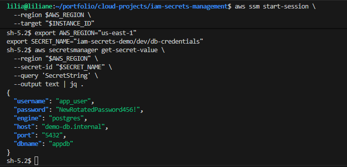

---

## Outcome

By the end of this project :

* I use **IAM least privilege** instead of broad access
* I store secrets in **AWS Secrets Manager** (not in code / `.env` / Git)
* I encrypt secrets with **KMS**
* My **EC2 application reads secrets securely via IAM role**
* Unauthorized IAM users get **AccessDenied**
* I can rotate/update a secret without changing app code permissions

This is a practical DevSecOps pattern I can reuse for:

* database passwords
* API keys
* third-party tokens
* app config secrets in dev/staging/prod

---

## Troubleshooting

### 1) `AccessDeniedException` on EC2 when reading secret

**Possible causes**

* EC2 role not attached correctly
* IAM policy missing `secretsmanager:GetSecretValue`
* KMS decrypt permission missing (`kms:Decrypt`)
* IAM propagation delay

**Fix**

```bash
aws ec2 describe-instances --region $AWS_REGION --instance-ids "$INSTANCE_ID" \
  --query 'Reservations[0].Instances[0].IamInstanceProfile'

aws iam list-attached-role-policies --role-name "$EC2_ROLE_NAME" --output table
sleep 30
```

---

### 2) SSM session not connecting

**Possible causes**

* Missing `AmazonSSMManagedInstanceCore` on EC2 role
* SSM agent not running
* Instance not yet initialized
* No network path to SSM endpoints (for private subnet environments, use NAT or VPC endpoints)

**Fix**

* Wait 1–2 minutes after launch
* Verify role policy attached
* In production private subnets, add SSM VPC endpoints (`ssm`, `ec2messages`, `ssmmessages`)

---

### 3) `ResourceNotFoundException` for secret

**Possible causes**

* Wrong secret name
* Wrong region

**Fix**

```bash
echo "$SECRET_NAME"
echo "$AWS_REGION"
aws secretsmanager list-secrets --region "$AWS_REGION" \
  --query "SecretList[?Name=='$SECRET_NAME'].Name"
```

---

### 4) KMS alias already exists

**Fix**
Use a unique alias or delete previous test resources first.

```bash
aws kms list-aliases --region $AWS_REGION --query "Aliases[?AliasName=='$KMS_ALIAS']"
```

---

## Cleanup

> Run cleanup when done to avoid charges.

### Step 1 — Terminate EC2

```bash
aws ec2 terminate-instances --region $AWS_REGION --instance-ids "$INSTANCE_ID"
aws ec2 wait instance-terminated --region $AWS_REGION --instance-ids "$INSTANCE_ID"
```

### Step 2 — Delete security group

```bash
aws ec2 delete-security-group --region $AWS_REGION --group-id "$EC2_SG_ID"
```

### Step 3 — Detach and delete IAM resources

```bash
aws iam remove-role-from-instance-profile \
  --instance-profile-name "$EC2_INSTANCE_PROFILE_NAME" \
  --role-name "$EC2_ROLE_NAME"

aws iam delete-instance-profile \
  --instance-profile-name "$EC2_INSTANCE_PROFILE_NAME"

aws iam detach-role-policy \
  --role-name "$EC2_ROLE_NAME" \
  --policy-arn "$EC2_POLICY_ARN"

aws iam detach-role-policy \
  --role-name "$EC2_ROLE_NAME" \
  --policy-arn "arn:aws:iam::aws:policy/AmazonSSMManagedInstanceCore"

aws iam delete-role --role-name "$EC2_ROLE_NAME"
aws iam delete-policy --policy-arn "$EC2_POLICY_ARN"
```

### Step 4 — Delete secret

```bash
# Force delete immediately for demo cleanup (careful in real environments)
aws secretsmanager delete-secret \
  --region $AWS_REGION \
  --secret-id "$SECRET_NAME" \
  --force-delete-without-recovery
```

### Step 5 — Delete KMS alias and key (optional for demo)

```bash
aws kms delete-alias --region $AWS_REGION --alias-name "$KMS_ALIAS"

# KMS keys are scheduled for deletion (cannot be deleted instantly)
aws kms schedule-key-deletion \
  --region $AWS_REGION \
  --key-id "$KMS_KEY_ID" \  #→ tells Secrets Manager which KMS key to use for
  --pending-window-in-days 7
```

---

## Final Note :

* “I designed this to remove secrets from code and servers.”
* “The EC2 app gets secret access through an IAM role, not static credentials.”
* “I enforced least privilege by allowing only one secret ARN.”
* “I proved security with two tests: EC2 success and unauthorized user denied.”
* “I also used KMS encryption and SSM access to avoid SSH key management.”

---

