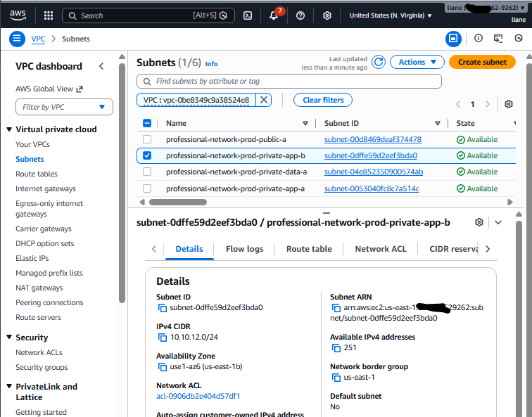

# Professional AWS Network Setup

## Context

For this project, I built a **professional AWS network foundation** that I can reuse for future projects like EC2 deployments, Jenkins, EKS, monitoring, databases, and internal applications.

Instead of creating a different network every time, I wanted one **clean, secure, reusable baseline**. This gives me a strong starting point before deploying anything else in AWS.

This project is based on a **production-style VPC design** with public and private subnet separation across multiple Availability Zones.

---

## Problem

When projects start without a proper network design, problems usually appear later:

* resources may be exposed to the internet by mistake
* application and database layers are not clearly separated
* routing becomes hard to manage
* security boundaries are weak
* troubleshooting becomes messy
* the setup is difficult to reuse for future projects

In real DevOps work, the network should come first because applications, CI/CD systems, Kubernetes clusters, and databases all depend on it.

---

## Solution

To solve that, I created a **professional AWS VPC network setup** with:

* **1 VPC**
* **2 public subnets**
* **2 private application subnets**
* **2 private data subnets**
* **1 Internet Gateway**
* **1 NAT Gateway**
* **separate route tables for each tier**
* **baseline security groups**
* **VPC Flow Logs for visibility**
* **tags for organization and reuse**

This setup gives me a reusable AWS network pattern where:

* public-facing resources can stay in public subnets
* application resources can run in private app subnets
* databases can stay isolated in private data subnets
* private resources can still reach the internet safely through NAT when needed
* traffic visibility is possible using Flow Logs

---

## Architecture


This architecture shows a **multi-tier AWS network design**:

* the **Internet Gateway** connects the VPC to the internet
* **public subnets** are used for internet-facing resources like load balancers and NAT Gateway
* **private app subnets** are for application servers, worker nodes, or internal compute
* **private data subnets** are for databases and internal-only services
* **VPC Flow Logs** provide network visibility for troubleshooting and monitoring

---

## Workflow with Goals + Screenshots

### 1. Define the network structure

**Goal:** Start with a clear and reusable network plan before creating resources.

I first defined the VPC CIDR range and separated the design into three subnet tiers:

* public
* private app
* private data

I also planned the setup across **two Availability Zones** to support better availability.

**Screenshot:**


**What it shows:** the initial project variables, region, and CIDR planning values used for the network build.

---

### 2. Confirm the AWS account and target region

**Goal:** Make sure resources are created in the correct AWS account and region before building anything.

Before creating the network, I verified the AWS identity and region configuration. This helps avoid mistakes like building resources in the wrong environment.

**Screenshot:**


**What it shows:** the AWS account identity, ARN, and configured region.

---

### 3. Create the VPC

**Goal:** Build the main network boundary for the project.

I created the VPC as the main container for all the subnets, routing, and security layers. I also enabled DNS support and DNS hostnames so the network can support future services properly.

**Screenshot:**


**What it shows:** the VPC ID and the main CIDR block for the environment.

---

### 4. Create the public subnets

**Goal:** Prepare internet-facing network zones for resources like load balancers and NAT Gateway.

I created two public subnets across two Availability Zones. These are the subnets that can support resources which need direct internet access.

**Screenshot:**


**What it shows:** both public subnets created in different AZs with the correct CIDR ranges.

---

### 5. Create the private application subnets

**Goal:** Prepare secure subnets for application workloads.

I created two private app subnets where future application servers, worker nodes, or internal services can run without being directly exposed to the internet.

**Screenshot:**


**What it shows:** private application subnets with their CIDRs and Availability Zones.

---

### 6. Create the private data subnets

**Goal:** Keep the database and data layer isolated.

I created two private data subnets for resources that should remain more restricted, such as databases, caches, or internal backend services.

**Screenshot:**


**What it shows:** private data subnets created with the correct CIDR layout.

---

### 7. Attach the Internet Gateway

**Goal:** Enable internet access for the public subnet tier.

I attached an Internet Gateway to the VPC so that public subnets can route traffic to and from the internet.

**Screenshot:**


**What it shows:** the Internet Gateway attached to the VPC.

---

### 8. Create the NAT Gateway

**Goal:** Allow private application subnets to access the internet safely for outbound traffic.

I created a NAT Gateway in one of the public subnets. This allows private app resources to download updates or reach external services without becoming public themselves.

**Screenshot:**


**What it shows:** the NAT Gateway in the `available` state.

---

### 9. Configure route tables

**Goal:** Control traffic flow correctly for each subnet tier.

I created separate route tables and associated them with the correct subnets:

* public route table → internet via Internet Gateway
* private app route table → outbound internet via NAT Gateway
* private data route table → no direct internet path

This is one of the most important parts of the design because it enforces separation between layers.

**Screenshot:**


**What it shows:** the public route to the IGW, the private app route to the NAT Gateway, and the private data route table without direct internet access.

---

### 10. Create baseline security groups

**Goal:** Build a reusable security pattern for future projects.

I created baseline security groups using a layered model:

* ALB security group for public web traffic
* App security group allowing traffic only from the ALB group
* DB security group allowing traffic only from the App group

This creates a cleaner and more secure communication path between layers.

**Screenshot:**


**What it shows:** the ALB, App, and DB security groups with restricted inbound access.

---

### 11. Enable VPC Flow Logs

**Goal:** Add network visibility for troubleshooting and auditing.

I enabled VPC Flow Logs and connected them to CloudWatch Logs so I can inspect accepted and rejected traffic later when troubleshooting connectivity or security issues.

**Screenshot:**


**What it shows:** the flow log attached to the VPC and the CloudWatch log group in place.

---

### 12. Verify the full network setup

**Goal:** Confirm the network foundation is complete and ready for reuse.

At the end, I verified that all major components were present:

* all subnets
* route tables
* security groups
* flow logs
* internet access path for the correct layers
* isolation for the data layer

**Screenshot:**


**What it shows:** the final verification view of subnets, route tables, and security groups.

---

## Business Impact

This project gives me a **reusable AWS network foundation** that supports future deployments in a cleaner and more professional way.

Business-wise, this matters because it helps with:

* **better security** through public/private separation
* **better scalability** by using a structure that can support more workloads later
* **better reliability** with multi-AZ subnet placement
* **faster project delivery** because the network baseline is already ready
* **easier troubleshooting** with flow logs and structured routing
* **better consistency** across all future AWS projects

Instead of rebuilding the network design every time, I can now reuse the same strong baseline for app hosting, CI/CD, monitoring, Kubernetes, and databases.

---

## Troubleshooting

### NAT Gateway stays in pending

Possible causes:

* NAT Gateway was placed in the wrong subnet
* the public subnet is not correctly configured
* Elastic IP allocation failed
* the Internet Gateway is missing or not attached properly

---

### Private app resources cannot reach the internet

Possible causes:

* private app route table is not pointing to the NAT Gateway
* NAT Gateway is not fully available
* the instance or workload is in the wrong subnet
* security rules are blocking outbound traffic

---

### Public resources are not reachable

Possible causes:

* public subnet route table does not point to the Internet Gateway
* security groups do not allow inbound traffic
* the resource is actually deployed in a private subnet
* NACL rules are blocking traffic

---

### Flow Logs are not showing data

Possible causes:

* Flow Logs were not attached correctly
* IAM permissions for Flow Logs are incomplete
* CloudWatch log group is missing
* not enough traffic has passed through the VPC yet

---

### Wrong account or region issue

Possible causes:

* AWS CLI profile is pointing to another account
* the region is different from the one expected
* verification was skipped before resource creation

---

## Useful CLI

### General verification

```bash
aws sts get-caller-identity
aws configure list
aws ec2 describe-vpcs
aws ec2 describe-subnets
aws ec2 describe-route-tables
aws ec2 describe-security-groups
aws ec2 describe-internet-gateways
aws ec2 describe-nat-gateways
aws ec2 describe-flow-logs
aws logs describe-log-groups
```

### Routing checks

```bash
aws ec2 describe-route-tables --route-table-ids <route-table-id>
aws ec2 describe-subnets --subnet-ids <subnet-id>
aws ec2 describe-nat-gateways --nat-gateway-ids <nat-gateway-id>
```

### Security checks

```bash
aws ec2 describe-security-groups --group-ids <sg-id>
aws ec2 describe-network-acls
```

### Flow Logs checks

```bash
aws ec2 describe-flow-logs
aws logs describe-log-streams --log-group-name <log-group-name>
aws logs tail <log-group-name> --follow
```

### Troubleshooting CLI

```bash
aws sts get-caller-identity
aws configure list
aws ec2 describe-route-tables
aws ec2 describe-security-groups
aws ec2 describe-nat-gateways
aws ec2 describe-flow-logs
aws logs describe-log-streams --log-group-name <log-group-name>
```

These commands are useful for checking whether the network is built correctly and for finding where connectivity problems are happening.

---

## Cleanup

After finishing the lab, I clean up the resources to avoid extra AWS charges, especially from:

* NAT Gateway
* Elastic IP
* Flow Logs
* CloudWatch log group
* security groups
* subnets
* route tables
* Internet Gateway
* VPC

Cleanup should be done in the right order so dependencies do not block deletion:

1. remove Flow Logs
2. remove security groups
3. delete NAT Gateway
4. release Elastic IP
5. detach and delete Internet Gateway
6. delete subnets
7. delete custom route tables
8. delete the VPC
9. remove optional log group and IAM role used for Flow Logs

---

