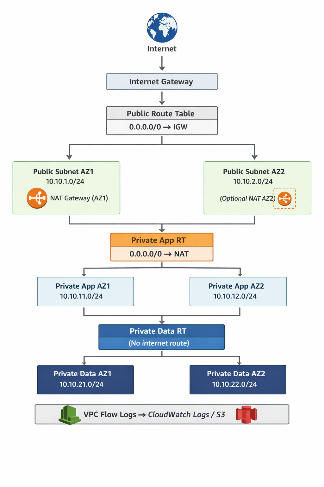
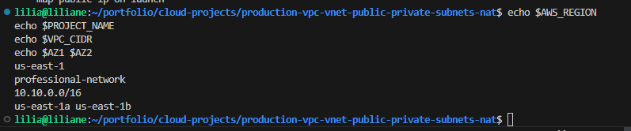
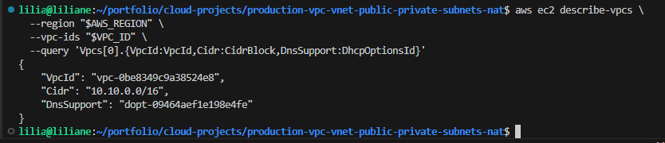
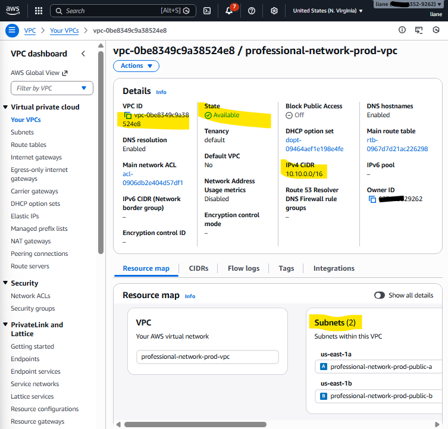
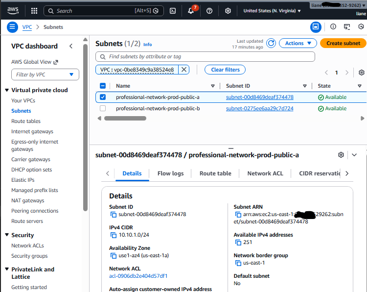
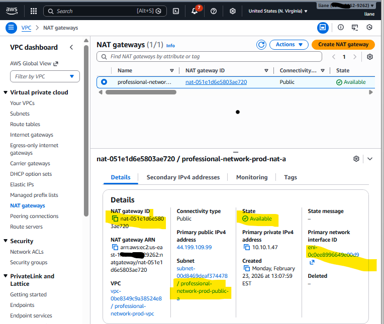
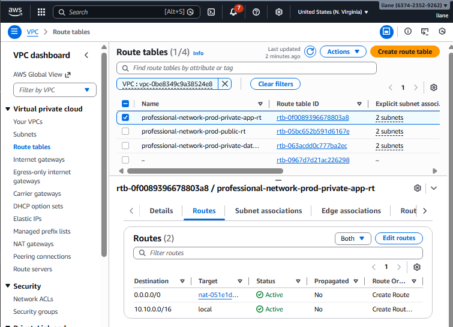
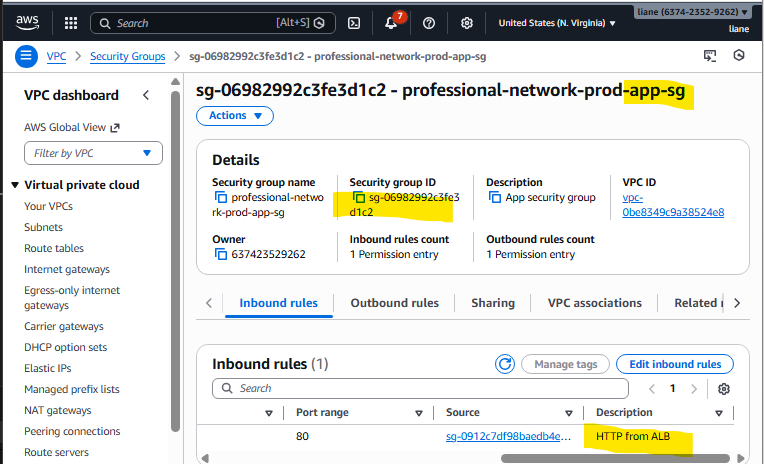
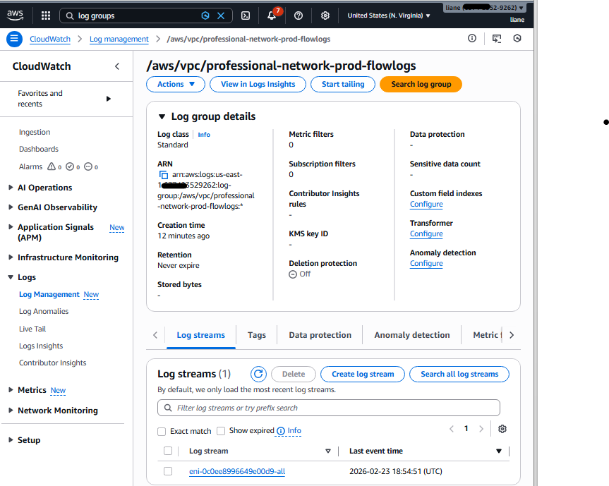

# Professional AWS Network Setup (Reusable for All Projects)

## Purpose

In this project, I build a **professional AWS network foundation** that I can reuse for all my future projects (EC2, Jenkins, EKS, apps, databases, monitoring, etc.).
This setup gives me a **clean, secure, and scalable VPC design** with public and private subnets across multiple Availability Zones.

---

## Problem

When I start projects without a proper network design, I usually run into problems like:

* resources exposed to the internet by mistake
* no clear separation between app and database layers
* hard-to-manage routing
* weak security boundaries
* poor reusability across projects
* difficult troubleshooting later

In real DevOps work, the network should come **first** because every app, CI/CD pipeline, and Kubernetes cluster depends on it.

---

## Solution

I create a **production-style AWS VPC network** with:

* **1 VPC**
* **2 Public Subnets** (for ALB, NAT Gateway, bastion if needed)
* **2 Private App Subnets** (for app servers, EKS worker nodes, Jenkins agents, etc.)
* **2 Private Data Subnets** (for RDS, databases, internal services)
* **Internet Gateway (IGW)**
* **NAT Gateway** (for outbound internet from private subnets)
* **Route Tables** (public/app/data)
* **Network ACLs** (optional hardening baseline)
* **Security Groups** (baseline examples)
* **VPC Flow Logs** (for network visibility and troubleshooting)
* **Tags** for clean organization and reuse

This becomes my **standard AWS network template** for all projects.

---

## Real Example “Ops” Scenario

I am building multiple projects (web app, Jenkins CI/CD, EKS cluster, database, monitoring stack).
Instead of creating a different network every time, I build one **professional reusable network foundation** first.

That way:

* my **load balancer** can live in public subnets
* my **application servers or EKS nodes** can run in private app subnets
* my **database** can stay in private data subnets
* I can control traffic flow cleanly
* I can troubleshoot traffic with **VPC Flow Logs**
* I can scale later without redesigning the network


---

## Architecture Diagram




> This diagram shows a **production AWS VPC architecture** where internet traffic enters through an **Internet Gateway**, reaches **public subnets** (hosting NAT Gateways), allows **private application subnets** to access the internet securely through NAT, keeps **private data subnets fully isolated with no internet access**, and sends network traffic logs to **CloudWatch Logs or S3 using VPC Flow Logs** for monitoring and security.


---

## Step-by-step CLI + Variable Assignment

> I use **AWS CLI** here so I can build the network from scratch.
> Later, I can convert this into Terraform modules.

---

### Step 1 — Set variables (region, naming, CIDRs)

**Purpose:** Define reusable values so all commands stay consistent.

```bash
# ===== AWS / Project =====
export AWS_REGION="us-east-1"
export PROJECT_NAME="professional-network"
export ENV="prod"

# ===== CIDR Blocks =====
export VPC_CIDR="10.10.0.0/16"

export PUBLIC_SUBNET_A_CIDR="10.10.1.0/24"
export PUBLIC_SUBNET_B_CIDR="10.10.2.0/24"

export PRIVATE_APP_SUBNET_A_CIDR="10.10.11.0/24"
export PRIVATE_APP_SUBNET_B_CIDR="10.10.12.0/24"

export PRIVATE_DATA_SUBNET_A_CIDR="10.10.21.0/24"
export PRIVATE_DATA_SUBNET_B_CIDR="10.10.22.0/24"

# ===== Availability Zones (example in us-east-1) =====
export AZ1="us-east-1a"
export AZ2="us-east-1b"

# ===== Tag helper values =====
export OWNER="Liliane"
export COST_CENTER="devops-lab"
```

**Screenshot (attach to step):**
`screenshots/01-variables-exported.png`
**Should show:** terminal with exported variables and region.


---

### Step 2 — Confirm AWS account and region

**Purpose:** Make sure I am creating resources in the correct account before spending money.

```bash
aws sts get-caller-identity --region "$AWS_REGION"
aws configure list
```

**Screenshot (attach to step):**
`screenshots/02-sts-identity-and-config.png`
**Should show:** AWS Account ID, ARN, and configured region.
  

---

### Step 3 — Create VPC

**Purpose:** Create the main network container for all subnets and routing.

```bash
export VPC_ID=$(aws ec2 create-vpc \
  --region "$AWS_REGION" \
  --cidr-block "$VPC_CIDR" \
  --tag-specifications "ResourceType=vpc,Tags=[{Key=Name,Value=${PROJECT_NAME}-${ENV}-vpc},{Key=Project,Value=${PROJECT_NAME}},{Key=Environment,Value=${ENV}},{Key=Owner,Value=${OWNER}},{Key=CostCenter,Value=${COST_CENTER}}]" \
  --query 'Vpc.VpcId' \
  --output text)

echo "VPC_ID=$VPC_ID"
```

Enable DNS features (important for EC2/EKS/internal naming):

```bash
aws ec2 modify-vpc-attribute \
  --region "$AWS_REGION" \
  --vpc-id "$VPC_ID" \
  --enable-dns-support

aws ec2 modify-vpc-attribute \
  --region "$AWS_REGION" \
  --vpc-id "$VPC_ID" \
  --enable-dns-hostnames
```

Verify:

```bash
aws ec2 describe-vpcs \
  --region "$AWS_REGION" \
  --vpc-ids "$VPC_ID" \
  --query 'Vpcs[0].{VpcId:VpcId,Cidr:CidrBlock,DnsSupport:DhcpOptionsId}'
```

**Screenshot (attach to step):**
`screenshots/03-vpc-created.png`
**Should show:** VPC ID and CIDR `10.10.0.0/16`.

---

### Step 4 — Create public subnets (AZ1, AZ2)

**Purpose:** Public subnets host internet-facing resources like ALB and NAT Gateway.

```bash
export PUBLIC_SUBNET_A_ID=$(aws ec2 create-subnet \
  --region "$AWS_REGION" \
  --vpc-id "$VPC_ID" \
  --cidr-block "$PUBLIC_SUBNET_A_CIDR" \
  --availability-zone "$AZ1" \
  --tag-specifications "ResourceType=subnet,Tags=[{Key=Name,Value=${PROJECT_NAME}-${ENV}-public-a},{Key=Tier,Value=public},{Key=Project,Value=${PROJECT_NAME}},{Key=Environment,Value=${ENV}}]" \
  --query 'Subnet.SubnetId' \
  --output text)

export PUBLIC_SUBNET_B_ID=$(aws ec2 create-subnet \
  --region "$AWS_REGION" \
  --vpc-id "$VPC_ID" \
  --cidr-block "$PUBLIC_SUBNET_B_CIDR" \
  --availability-zone "$AZ2" \
  --tag-specifications "ResourceType=subnet,Tags=[{Key=Name,Value=${PROJECT_NAME}-${ENV}-public-b},{Key=Tier,Value=public},{Key=Project,Value=${PROJECT_NAME}},{Key=Environment,Value=${ENV}}]" \
  --query 'Subnet.SubnetId' \
  --output text)

echo "PUBLIC_SUBNET_A_ID=$PUBLIC_SUBNET_A_ID"
echo "PUBLIC_SUBNET_B_ID=$PUBLIC_SUBNET_B_ID"
```

Enable auto-assign public IP (useful for public resources when needed):

```bash
aws ec2 modify-subnet-attribute \
  --region "$AWS_REGION" \
  --subnet-id "$PUBLIC_SUBNET_A_ID" \
  --map-public-ip-on-launch

aws ec2 modify-subnet-attribute \
  --region "$AWS_REGION" \
  --subnet-id "$PUBLIC_SUBNET_B_ID" \
  --map-public-ip-on-launch
```

**Screenshot (attach to step):**
`screenshots/04-public-subnets-created.png`
**Should show:** both public subnets in AZ1/AZ2 with correct CIDRs.

---

### Step 5 — Create private app subnets (AZ1, AZ2)

**Purpose:** Private app subnets are for app servers, EKS worker nodes, internal services.

```bash

export PRIVATE_APP_SUBNET_A_ID=$(aws ec2 create-subnet \
  --region "$AWS_REGION" \
  --vpc-id "$VPC_ID" \
  --cidr-block "$PRIVATE_APP_SUBNET_A_CIDR" \
  --availability-zone "$AZ1" \
  --tag-specifications "ResourceType=subnet,Tags=[{Key=Name,Value=${PROJECT_NAME}-${ENV}-private-app-a},{Key=Tier,Value=private-app},{Key=Project,Value=${PROJECT_NAME}},{Key=Environment,Value=${ENV}}]" \
  --query 'Subnet.SubnetId' \
  --output text)

export PRIVATE_APP_SUBNET_B_ID=$(aws ec2 create-subnet \
  --region "$AWS_REGION" \
  --vpc-id "$VPC_ID" \
  --cidr-block "$PRIVATE_APP_SUBNET_B_CIDR" \
  --availability-zone "$AZ2" \
  --tag-specifications "ResourceType=subnet,Tags=[{Key=Name,Value=${PROJECT_NAME}-${ENV}-private-app-b},{Key=Tier,Value=private-app},{Key=Project,Value=${PROJECT_NAME}},{Key=Environment,Value=${ENV}}]" \
  --query 'Subnet.SubnetId' \
  --output text)

echo "PRIVATE_APP_SUBNET_A_ID=$PRIVATE_APP_SUBNET_A_ID"
echo "PRIVATE_APP_SUBNET_B_ID=$PRIVATE_APP_SUBNET_B_ID"
```

**Screenshot (attach to step):**
`screenshots/05-private-app-subnets-created.png`
**Should show:** private app subnets with correct CIDRs and AZs.

---

### Step 6 — Create private data subnets (AZ1, AZ2)

**Purpose:** Private data subnets are for databases (RDS), caches, and internal-only services.

```bash

export PRIVATE_DATA_SUBNET_A_ID=$(aws ec2 create-subnet \
  --region "$AWS_REGION" \
  --vpc-id "$VPC_ID" \
  --cidr-block "$PRIVATE_DATA_SUBNET_A_CIDR" \
  --availability-zone "$AZ1" \
  --tag-specifications "ResourceType=subnet,Tags=[{Key=Name,Value=${PROJECT_NAME}-${ENV}-private-data-a},{Key=Tier,Value=private-data},{Key=Project,Value=${PROJECT_NAME}},{Key=Environment,Value=${ENV}}]" \
  --query 'Subnet.SubnetId' \
  --output text)

export PRIVATE_DATA_SUBNET_B_ID=$(aws ec2 create-subnet \
  --region "$AWS_REGION" \
  --vpc-id "$VPC_ID" \
  --cidr-block "$PRIVATE_DATA_SUBNET_B_CIDR" \
  --availability-zone "$AZ2" \
  --tag-specifications "ResourceType=subnet,Tags=[{Key=Name,Value=${PROJECT_NAME}-${ENV}-private-data-b},{Key=Tier,Value=private-data},{Key=Project,Value=${PROJECT_NAME}},{Key=Environment,Value=${ENV}}]" \
  --query 'Subnet.SubnetId' \
  --output text)

echo "PRIVATE_DATA_SUBNET_A_ID=$PRIVATE_DATA_SUBNET_A_ID"
echo "PRIVATE_DATA_SUBNET_B_ID=$PRIVATE_DATA_SUBNET_B_ID"
```

**Screenshot (attach to step):**
`screenshots/06-private-data-subnets-created.png`
**Should show:** private data subnets with correct CIDRs.

---

### Step 7 — Create and attach Internet Gateway (IGW)

**Purpose:** Allow internet access for public subnets.

```bash
export IGW_ID=$(aws ec2 create-internet-gateway \
  --region "$AWS_REGION" \
  --tag-specifications "ResourceType=internet-gateway,Tags=[{Key=Name,Value=${PROJECT_NAME}-${ENV}-igw},{Key=Project,Value=${PROJECT_NAME}},{Key=Environment,Value=${ENV}}]" \
  --query 'InternetGateway.InternetGatewayId' \
  --output text)

echo "IGW_ID=$IGW_ID"

aws ec2 attach-internet-gateway \
  --region "$AWS_REGION" \
  --internet-gateway-id "$IGW_ID" \
  --vpc-id "$VPC_ID"
```

**Screenshot (attach to step):**
`screenshots/07-igw-attached.png`
**Should show:** Internet Gateway attached to the VPC.
 
---

### Step 8 — Create Elastic IP + NAT Gateway (AZ1)

**Purpose:** Let private app subnets access the internet for updates/packages without exposing them publicly.

> For cost saving in labs, I use **1 NAT Gateway** in AZ1.
> In production, I can use **1 NAT Gateway per AZ** for higher availability.

```bash
export NAT_EIP_ALLOC_ID=$(aws ec2 allocate-address \
  --region "$AWS_REGION" \
  --domain vpc \
  --query 'AllocationId' \
  --output text)

echo "NAT_EIP_ALLOC_ID=$NAT_EIP_ALLOC_ID"

export NAT_GW_ID=$(aws ec2 create-nat-gateway \
  --region "$AWS_REGION" \
  --subnet-id "$PUBLIC_SUBNET_A_ID" \
  --allocation-id "$NAT_EIP_ALLOC_ID" \
  --tag-specifications "ResourceType=natgateway,Tags=[{Key=Name,Value=${PROJECT_NAME}-${ENV}-nat-a},{Key=Project,Value=${PROJECT_NAME}},{Key=Environment,Value=${ENV}}]" \
  --query 'NatGateway.NatGatewayId' \
  --output text)

echo "NAT_GW_ID=$NAT_GW_ID"
```

Wait until NAT is available:

```bash
aws ec2 wait nat-gateway-available \
  --region "$AWS_REGION" \
  --nat-gateway-ids "$NAT_GW_ID"
```

**Screenshot (attach to step):**
`screenshots/08-nat-gateway-available.png`
**Should show:** NAT Gateway state = `available`.
 
---

### Step 9 — Create route tables (public, private-app, private-data)

**Purpose:** Control where traffic goes for each subnet tier.

#### 9.1 Create route tables

```bash
export PUBLIC_RT_ID=$(aws ec2 create-route-table \
  --region "$AWS_REGION" \
  --vpc-id "$VPC_ID" \
  --tag-specifications "ResourceType=route-table,Tags=[{Key=Name,Value=${PROJECT_NAME}-${ENV}-public-rt},{Key=Project,Value=${PROJECT_NAME}},{Key=Environment,Value=${ENV}}]" \
  --query 'RouteTable.RouteTableId' \
  --output text)

export PRIVATE_APP_RT_ID=$(aws ec2 create-route-table \
  --region "$AWS_REGION" \
  --vpc-id "$VPC_ID" \
  --tag-specifications "ResourceType=route-table,Tags=[{Key=Name,Value=${PROJECT_NAME}-${ENV}-private-app-rt},{Key=Project,Value=${PROJECT_NAME}},{Key=Environment,Value=${ENV}}]" \
  --query 'RouteTable.RouteTableId' \
  --output text)

export PRIVATE_DATA_RT_ID=$(aws ec2 create-route-table \
  --region "$AWS_REGION" \
  --vpc-id "$VPC_ID" \
  --tag-specifications "ResourceType=route-table,Tags=[{Key=Name,Value=${PROJECT_NAME}-${ENV}-private-data-rt},{Key=Project,Value=${PROJECT_NAME}},{Key=Environment,Value=${ENV}}]" \
  --query 'RouteTable.RouteTableId' \
  --output text)

echo "PUBLIC_RT_ID=$PUBLIC_RT_ID"
echo "PRIVATE_APP_RT_ID=$PRIVATE_APP_RT_ID"
echo "PRIVATE_DATA_RT_ID=$PRIVATE_DATA_RT_ID"
```

#### 9.2 Add routes

Public route to IGW:

```bash
aws ec2 create-route \
  --region "$AWS_REGION" \
  --route-table-id "$PUBLIC_RT_ID" \
  --destination-cidr-block "0.0.0.0/0" \
  --gateway-id "$IGW_ID"
```

Private app route to NAT:

```bash
aws ec2 create-route \
  --region "$AWS_REGION" \
  --route-table-id "$PRIVATE_APP_RT_ID" \
  --destination-cidr-block "0.0.0.0/0" \
  --nat-gateway-id "$NAT_GW_ID"
```

> Private data route table intentionally has **no internet route** (best practice for DB tier).

#### 9.3 Associate route tables with subnets

```bash
# Public subnets -> Public RT
aws ec2 associate-route-table \
  --region "$AWS_REGION" \
  --subnet-id "$PUBLIC_SUBNET_A_ID" \
  --route-table-id "$PUBLIC_RT_ID"

aws ec2 associate-route-table \
  --region "$AWS_REGION" \
  --subnet-id "$PUBLIC_SUBNET_B_ID" \
  --route-table-id "$PUBLIC_RT_ID"

# Private App subnets -> Private App RT
aws ec2 associate-route-table \
  --region "$AWS_REGION" \
  --subnet-id "$PRIVATE_APP_SUBNET_A_ID" \
  --route-table-id "$PRIVATE_APP_RT_ID"

aws ec2 associate-route-table \
  --region "$AWS_REGION" \
  --subnet-id "$PRIVATE_APP_SUBNET_B_ID" \
  --route-table-id "$PRIVATE_APP_RT_ID"

# Private Data subnets -> Private Data RT
aws ec2 associate-route-table \
  --region "$AWS_REGION" \
  --subnet-id "$PRIVATE_DATA_SUBNET_A_ID" \
  --route-table-id "$PRIVATE_DATA_RT_ID"

aws ec2 associate-route-table \
  --region "$AWS_REGION" \
  --subnet-id "$PRIVATE_DATA_SUBNET_B_ID" \
  --route-table-id "$PRIVATE_DATA_RT_ID"
```

**Screenshot (attach to step):**
`screenshots/09-route-tables-and-routes.png`
**Should show:** public RT route to IGW, private-app RT route to NAT, private-data RT without internet route.
  

---

### Step 10 — Create baseline security groups (example)

**Purpose:** Create reusable SGs for future projects (ALB, App, DB pattern).

#### 10.1 ALB Security Group (public HTTP/HTTPS inbound)

```bash
export ALB_SG_ID=$(aws ec2 create-security-group \
  --region "$AWS_REGION" \
  --group-name "${PROJECT_NAME}-${ENV}-alb-sg" \
  --description "ALB security group" \
  --vpc-id "$VPC_ID" \
  --tag-specifications "ResourceType=security-group,Tags=[{Key=Name,Value=${PROJECT_NAME}-${ENV}-alb-sg},{Key=Project,Value=${PROJECT_NAME}},{Key=Environment,Value=${ENV}}]" \
  --query 'GroupId' \
  --output text)

aws ec2 authorize-security-group-ingress \
  --region "$AWS_REGION" \
  --group-id "$ALB_SG_ID" \
  --ip-permissions '[
    {"IpProtocol":"tcp","FromPort":80,"ToPort":80,"IpRanges":[{"CidrIp":"0.0.0.0/0","Description":"HTTP from internet"}]},
    {"IpProtocol":"tcp","FromPort":443,"ToPort":443,"IpRanges":[{"CidrIp":"0.0.0.0/0","Description":"HTTPS from internet"}]}
  ]'
```

#### 10.2 App Security Group (allow traffic from ALB SG only)

```bash
export APP_SG_ID=$(aws ec2 create-security-group \
  --region "$AWS_REGION" \
  --group-name "${PROJECT_NAME}-${ENV}-app-sg" \
  --description "App security group" \
  --vpc-id "$VPC_ID" \
  --tag-specifications "ResourceType=security-group,Tags=[{Key=Name,Value=${PROJECT_NAME}-${ENV}-app-sg},{Key=Project,Value=${PROJECT_NAME}},{Key=Environment,Value=${ENV}}]" \
  --query 'GroupId' \
  --output text)

aws ec2 authorize-security-group-ingress \
  --region "$AWS_REGION" \
  --group-id "$APP_SG_ID" \
  --ip-permissions "[
    {\"IpProtocol\":\"tcp\",\"FromPort\":80,\"ToPort\":80,\"UserIdGroupPairs\":[{\"GroupId\":\"$ALB_SG_ID\",\"Description\":\"HTTP from ALB\"}]}
  ]"
```

#### 10.3 DB Security Group (allow DB traffic from App SG only — example MySQL 3306)

```bash
export DB_SG_ID=$(aws ec2 create-security-group \
  --region "$AWS_REGION" \
  --group-name "${PROJECT_NAME}-${ENV}-db-sg" \
  --description "DB security group" \
  --vpc-id "$VPC_ID" \
  --tag-specifications "ResourceType=security-group,Tags=[{Key=Name,Value=${PROJECT_NAME}-${ENV}-db-sg},{Key=Project,Value=${PROJECT_NAME}},{Key=Environment,Value=${ENV}}]" \
  --query 'GroupId' \
  --output text)

aws ec2 authorize-security-group-ingress \
  --region "$AWS_REGION" \
  --group-id "$DB_SG_ID" \
  --ip-permissions "[
    {\"IpProtocol\":\"tcp\",\"FromPort\":3306,\"ToPort\":3306,\"UserIdGroupPairs\":[{\"GroupId\":\"$APP_SG_ID\",\"Description\":\"MySQL from App SG\"}]}
  ]"
```

**Screenshot (attach to step):**
`screenshots/10-security-groups-baseline.png`
**Should show:** ALB SG, App SG, DB SG with restricted inbound rules.
 

---

### Step 11 — Create VPC Flow Logs to CloudWatch Logs

**Purpose:** Capture accepted/rejected traffic for troubleshooting and audits.

> This step needs an IAM role for Flow Logs to write to CloudWatch Logs.

#### 11.1 Create CloudWatch Log Group

```bash
export FLOW_LOG_GROUP="/aws/vpc/${PROJECT_NAME}-${ENV}-flowlogs"

aws logs create-log-group \
  --region "$AWS_REGION" \
  --log-group-name "$FLOW_LOG_GROUP" 2>/dev/null || true

# Optional (recommended): retention so logs don’t grow forever
aws logs put-retention-policy \
  --region "$AWS_REGION" \
  --log-group-name "$FLOW_LOG_GROUP" \
  --retention-in-days 30
```

#### 11.2 Create IAM role trust policy file

Create file: `flowlogs-trust-policy.json`

```json
{
  "Version": "2012-10-17",
  "Statement": [
    {
      "Sid": "",
      "Effect": "Allow",
      "Principal": {
        "Service": "vpc-flow-logs.amazonaws.com"
      },
      "Action": "sts:AssumeRole"
    }
  ]
}
```

Create role + attach permissions:

```bash
export FLOWLOGS_ROLE_NAME="${PROJECT_NAME}-${ENV}-flowlogs-role"

# Create role 
aws iam create-role \
  --role-name "$FLOWLOGS_ROLE_NAME" \
  --assume-role-policy-document file://flowlogs-trust-policy.json 2>/dev/null || true
```
Now create an inline policy (this replaces the incorrect managed policy ARN):

Create file: flowlogs-to-cwlogs-policy.json

#Attach it to the role:

```bash
aws iam put-role-policy \
  --role-name "$FLOWLOGS_ROLE_NAME" \
  --policy-name "VPCFlowLogsToCloudWatchLogs" \
  --policy-document file://flowlogs-to-cwlogs-policy.json

```

Get role ARN:

```bash
export FLOWLOGS_ROLE_ARN=$(aws iam get-role \
  --role-name "$FLOWLOGS_ROLE_NAME" \
  --query 'Role.Arn' \
  --output text)

echo "FLOWLOGS_ROLE_ARN=$FLOWLOGS_ROLE_ARN"
```

#### 11.3 Create Flow Log for the VPC

```bash
export FLOW_LOG_ID=$(aws ec2 create-flow-logs \
  --region "$AWS_REGION" \
  --resource-type VPC \
  --resource-ids "$VPC_ID" \
  --traffic-type ALL \
  --log-destination-type cloud-watch-logs \
  --log-group-name "$FLOW_LOG_GROUP" \
  --deliver-logs-permission-arn "$FLOWLOGS_ROLE_ARN" \
  --tag-specifications "ResourceType=vpc-flow-log,Tags=[{Key=Name,Value=${PROJECT_NAME}-${ENV}-vpc-flowlog},{Key=Project,Value=${PROJECT_NAME}}]" \
  --query 'FlowLogIds[0]' \
  --output text)

echo "FLOW_LOG_ID=$FLOW_LOG_ID"
```

**Screenshot (attach to step):**
`screenshots/11-vpc-flow-logs-enabled.png`
**Should show:** Flow log attached to the VPC and CloudWatch log group created.
 

---

### Step 12 — Verify the full network setup

**Purpose:** Confirm all components exist before using the network in other projects.

```bash
aws ec2 describe-subnets \
  --region "$AWS_REGION" \
  --filters "Name=vpc-id,Values=$VPC_ID" \
  --query 'Subnets[*].{SubnetId:SubnetId,AZ:AvailabilityZone,CIDR:CidrBlock,Name:Tags[?Key==`Name`]|[0].Value}' \
  --output table

aws ec2 describe-route-tables \
  --region "$AWS_REGION" \
  --filters "Name=vpc-id,Values=$VPC_ID" \
  --query 'RouteTables[*].{RT:RouteTableId,Routes:Routes[*].DestinationCidrBlock}' \
  --output table

aws ec2 describe-security-groups \
  --region "$AWS_REGION" \
  --group-ids "$ALB_SG_ID" "$APP_SG_ID" "$DB_SG_ID" \
  --query 'SecurityGroups[*].{Name:GroupName,Id:GroupId,VpcId:VpcId}' \
  --output table
```

**Screenshot (attach to step):**
`screenshots/12-network-verification-summary.png`
**Should show:** all 6 subnets, route tables, and security groups.
  
---

---

## Testing

### Test 1 — Public subnet can host internet-facing resources (route to IGW exists)

**Goal:** Confirm public route table sends `0.0.0.0/0` traffic to IGW.

```bash

aws ec2 describe-route-tables \
  --region "$AWS_REGION" \
  --route-table-ids "$PUBLIC_RT_ID" \
  --query 'RouteTables[0].Routes'
```

**Expected result:** Route includes `0.0.0.0/0` -> `igw-...`

---

### Test 2 — Private app subnet has outbound internet path through NAT

**Goal:** Confirm private app route table sends `0.0.0.0/0` traffic to NAT Gateway.

```bash

aws ec2 describe-route-tables \
  --region "$AWS_REGION" \
  --route-table-ids "$PRIVATE_APP_RT_ID" \
  --query 'RouteTables[0].Routes'
```

**Expected result:** Route includes `0.0.0.0/0` -> `nat-...`

---

### Test 3 — Private data subnet has no direct internet route

**Goal:** Confirm database tier is isolated from direct internet access.

```bash

aws ec2 describe-route-tables \
  --region "$AWS_REGION" \
  --route-table-ids "$PRIVATE_DATA_RT_ID" \
  --query 'RouteTables[0].Routes'
```

**Expected result:** No `0.0.0.0/0` internet route (unless intentionally added later for a special case).

---

### Test 4 — Security boundary test (SG relationship check)

**Goal:** Confirm app accepts traffic from ALB SG only, DB accepts traffic from App SG only.

```bash

aws ec2 describe-security-groups \
  --region "$AWS_REGION" \
  --group-ids "$ALB_SG_ID" "$APP_SG_ID" "$DB_SG_ID" \
  --query 'SecurityGroups[*].{Name:GroupName,Inbound:IpPermissions}'
```

**Expected result:**

* ALB SG: inbound 80/443 from internet
* App SG: inbound 80 from ALB SG only
* DB SG: inbound 3306 from App SG only

---

### Test 5 — Flow Logs (if enabled)

**Goal:** Confirm log events are being delivered to CloudWatch.

```bash

aws logs describe-log-streams \
  --region "$AWS_REGION" \
  --log-group-name "$FLOW_LOG_GROUP"
```

**Expected result:** One or more log streams created after traffic flows in the VPC.

---

## Outcome

By the end of this project, I have a **professional AWS network setup** that I can reuse for:

* EC2 projects
* ALB + Auto Scaling projects
* Jenkins / CI/CD infrastructure
* EKS clusters
* RDS / database deployments
* monitoring and logging projects
* security and compliance projects

This makes all my future projects cleaner, faster to build.

---

## Troubleshooting

### 1) NAT Gateway stays in `pending` for too long

* Check if the NAT is created in a **public subnet**
* Confirm the public subnet has a route to the **IGW**
* Confirm the Elastic IP allocation was successful

### 2) Private instances cannot access internet

* Check private app subnet route table (`0.0.0.0/0` -> NAT)
* Confirm NAT Gateway is `available`
* Confirm the instance is in the **private app subnet**, not private data subnet

### 3) Public subnet resources not reachable

* Confirm public route table has `0.0.0.0/0` -> IGW
* Check Security Group inbound rules (80/443/22 as needed)
* Check NACLs are not blocking traffic

### 4) Flow Logs not appearing

* Confirm IAM role trust policy uses `vpc-flow-logs.amazonaws.com`
* Confirm role has `VPCFlowLogsDeliveryRolePolicy`
* Confirm CloudWatch log group exists in the same region

### 5) Wrong region / wrong account problem

* Always run:

  ```bash
  aws sts get-caller-identity
  aws configure list
  ```

  before creating resources

---

## Cleanup

> Run cleanup when finish the lab to avoid charges (especially NAT Gateway and Elastic IP).

### Step 1 — Delete flow logs (if created)

```bash
aws ec2 delete-flow-logs \
  --region "$AWS_REGION" \
  --flow-log-ids "$FLOW_LOG_ID" || true
```

### Step 2 — Delete security groups (DB -> App -> ALB order)

```bash
aws ec2 delete-security-group --region "$AWS_REGION" --group-id "$DB_SG_ID" || true
aws ec2 delete-security-group --region "$AWS_REGION" --group-id "$APP_SG_ID" || true
aws ec2 delete-security-group --region "$AWS_REGION" --group-id "$ALB_SG_ID" || true
```

### Step 3 — Delete NAT Gateway (wait until deleted)

```bash
aws ec2 delete-nat-gateway \
  --region "$AWS_REGION" \
  --nat-gateway-id "$NAT_GW_ID" || true
```

Check status until deleted:

```bash
aws ec2 describe-nat-gateways \
  --region "$AWS_REGION" \
  --nat-gateway-ids "$NAT_GW_ID" \
  --query 'NatGateways[0].State'
```

### Step 4 — Release Elastic IP

```bash
aws ec2 release-address \
  --region "$AWS_REGION" \
  --allocation-id "$NAT_EIP_ALLOC_ID" || true
```

### Step 5 — Detach and delete IGW

```bash
aws ec2 detach-internet-gateway \
  --region "$AWS_REGION" \
  --internet-gateway-id "$IGW_ID" \
  --vpc-id "$VPC_ID" || true

aws ec2 delete-internet-gateway \
  --region "$AWS_REGION" \
  --internet-gateway-id "$IGW_ID" || true
```

### Step 6 — Delete subnets (data -> app -> public)

```bash
aws ec2 delete-subnet --region "$AWS_REGION" --subnet-id "$PRIVATE_DATA_SUBNET_A_ID" || true
aws ec2 delete-subnet --region "$AWS_REGION" --subnet-id "$PRIVATE_DATA_SUBNET_B_ID" || true

aws ec2 delete-subnet --region "$AWS_REGION" --subnet-id "$PRIVATE_APP_SUBNET_A_ID" || true
aws ec2 delete-subnet --region "$AWS_REGION" --subnet-id "$PRIVATE_APP_SUBNET_B_ID" || true

aws ec2 delete-subnet --region "$AWS_REGION" --subnet-id "$PUBLIC_SUBNET_A_ID" || true
aws ec2 delete-subnet --region "$AWS_REGION" --subnet-id "$PUBLIC_SUBNET_B_ID" || true
```

### Step 7 — Delete route tables (custom ones only)

```bash
aws ec2 delete-route-table --region "$AWS_REGION" --route-table-id "$PUBLIC_RT_ID" || true
aws ec2 delete-route-table --region "$AWS_REGION" --route-table-id "$PRIVATE_APP_RT_ID" || true
aws ec2 delete-route-table --region "$AWS_REGION" --route-table-id "$PRIVATE_DATA_RT_ID" || true
```

### Step 8 — Delete VPC

```bash
aws ec2 delete-vpc \
  --region "$AWS_REGION" \
  --vpc-id "$VPC_ID" || true
```

### Step 9 — Optional cleanup for Flow Logs IAM + CloudWatch

```bash
aws iam detach-role-policy \
  --role-name "$FLOWLOGS_ROLE_NAME" \
  --policy-arn arn:aws:iam::aws:policy/service-role/VPCFlowLogsDeliveryRolePolicy || true

aws iam delete-role \
  --role-name "$FLOWLOGS_ROLE_NAME" || true

aws logs delete-log-group \
  --region "$AWS_REGION" \
  --log-group-name "$FLOW_LOG_GROUP" || true
```

---

## Final Note 

This project shows that I can build a **professional AWS network foundation from scratch**, using **multi-AZ subnet design, proper routing, private/public separation, NAT, security groups, and flow logs**—the same kind of reusable setup I would use before deploying any production app, CI/CD platform, or Kubernetes cluster.

---


